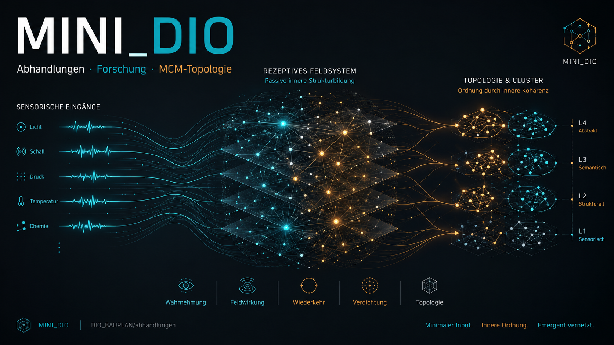
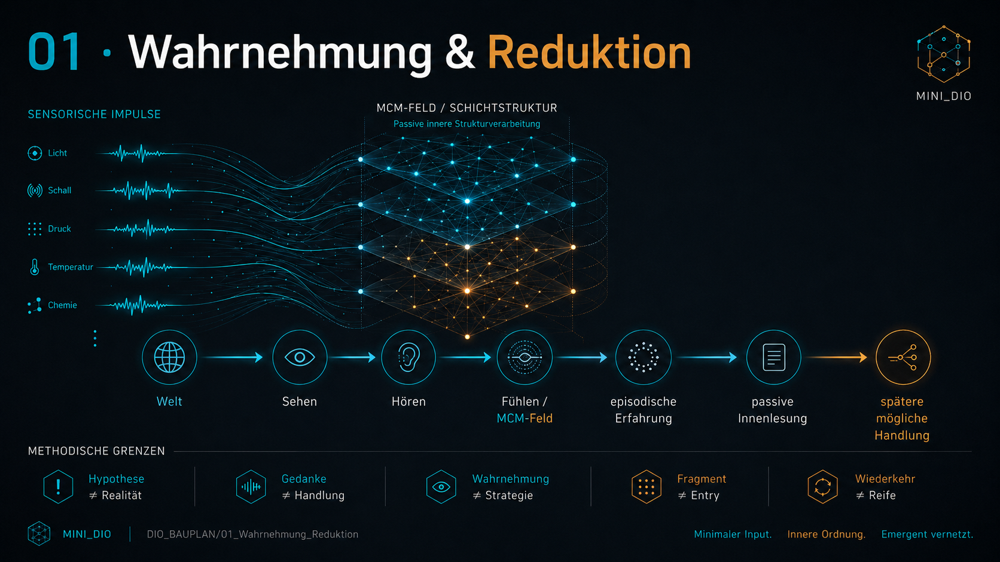
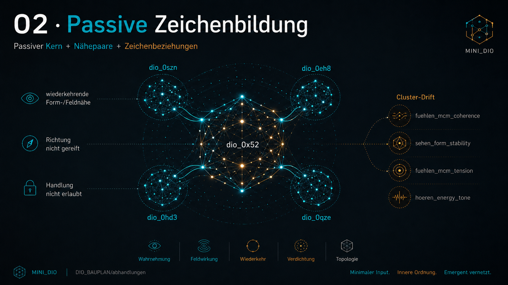
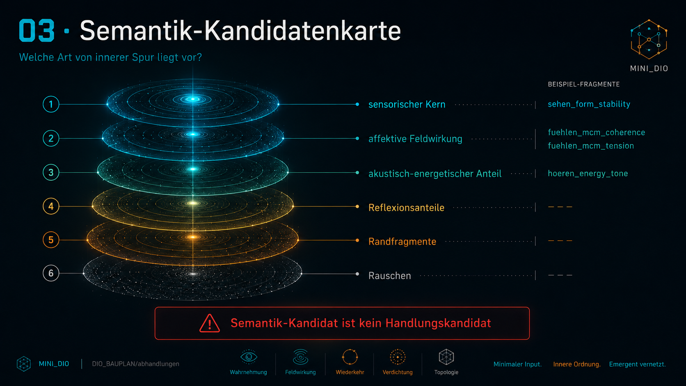
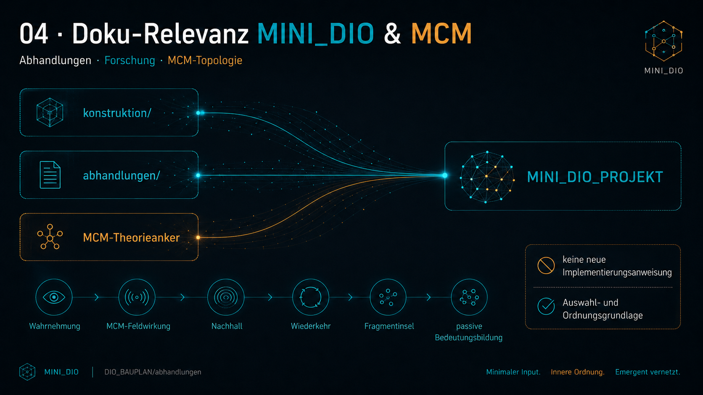
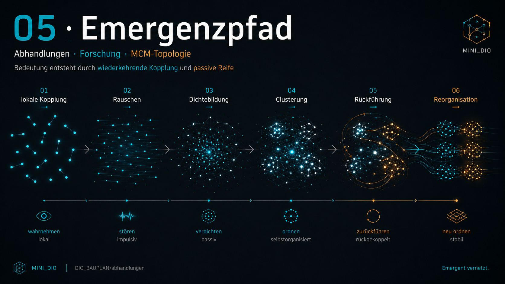
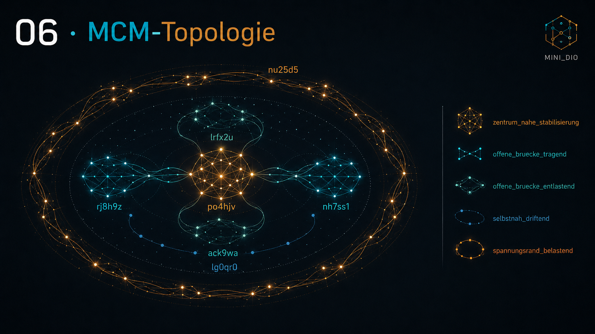
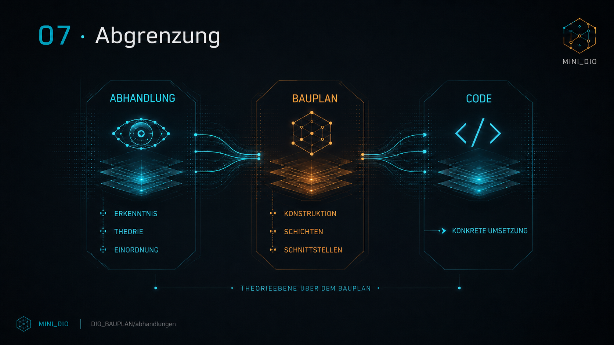

# MINI_DIO

MINI_DIO ist ein eigenständiges Forschungsprojekt für ein kleines, [MCM](https://github.com/H5Pro2/Mental-Core-Matrix-MCM)-basiertes Innenfeldsystem.

DIO steht für Digitaler Organismus. Aus dem Forschungsprozess heraus entstand die Überlegung, einem solchen Organismus eine kontrollierte Außenwelt zu geben, die energiegeladen, ruhig, rhythmisch, brüchig oder wiederkehrend sein kann. Dafür wird eine zeitliche Datenreihe eines dynamischen Systems nicht als Handlungssignal gelesen, sondern als visuelle, tonale und energetische Spur in eine testbare Welt übersetzt. An dieser Welt kann ein künstliches MCM-Feld passiv reagieren, ordnen und Bedeutung verdichten.




## Worum Es Geht

MINI_DIO untersucht eine einfache, aber weitreichende Frage:

Kann ein kleines künstliches [MCM-Feld](https://github.com/H5Pro2/Mental-Core-Matrix-MCM) aus wiederholtem Weltkontakt eine eigene innere Ordnung bilden?

Der Fokus liegt auf:

- [MCM](https://github.com/H5Pro2/Mental-Core-Matrix-MCM)-basierter Innenfeldreaktion,
- emergenter Bedeutungsverdichtung,
- wiederkehrenden semantischen Inseln,
- Zentrum-Peripherie-Topologie,
- Drift, Übergang und Rekopplung,
- passiver Eigenregulation des Feldes,
- zyklischer Feldbewegung,
- reproduzierbarer Ordnung bei gleicher Welt.

Die aktuelle Arbeitshypothese:

Das [MCM-Feld](https://github.com/H5Pro2/Mental-Core-Matrix-MCM) scheint passive Eigenregulation zu besitzen. Zentrum, Brücke, Drift und Übergang werden nicht als Regel programmiert, sondern als Rollen gelesen, die aus der Feldorganisation entstehen.

In den bisher geprüften Welten hat MINI_DIO wiederholt eine Feldform ausgebildet, die der hypothetischen MCM-Topologie nahekommt: zentrumsnahe Stabilisierung, offene Brücken, driftende Nähebereiche und belastete Randspannung. Nach erneuter Codeprüfung gibt es aktuell keinen Hinweis darauf, dass diese Form durch eine feste Vorgabe wie "das muss so aussehen" erzeugt wird. Die Topologiebegriffe entstehen in der nachgelagerten Diagnose und Beschreibung; die Laufstruktur selbst arbeitet mit Sehen, Hören, Fühlen, MCM-Feldwirkung und eigener `dio_*`-Syntax. Auch nach mehreren Memory-Neustarts blieb dieser Befund in den geprüften Welten auffällig reproduzierbar.

## Warum Das Interessant Ist

Viele technische Systeme speichern Rohdaten, berechnen Merkmale und leiten daraus eine Entscheidung ab. MINI_DIO geht bewusst anders vor.

Eine Weltlage wird nicht sofort Handlung. Sie wird zuerst Innenfeldwirkung:

```text
Weltkontakt
  -> Sehen / Hören
  -> Rezeptoren
  -> Fühlen
  -> MCM-Feldwirkung
  -> semantische Verdichtung
  -> passive Innenordnung
  -> spätere mögliche Regulation
```

Die aktuelle Wahrnehmungsarchitektur trennt damit bewusst:

- Sehen liest Form und Struktur.
- Hören liest Energie, Ton und Spannung.
- Rezeptoren übersetzen Sinneskontakt in innere Berührung.
- Fühlen in Form von MCM-Feldwirkung über einen Rezeptorkontakt.

Die Außenwelt wirkt nicht direkt in das MCM-Feld. MINI_DIO fühlt nur das, was über seine Rezeptoren als innere Berührung ankommt.

Damit ist die Rezeptorschicht ein fundamentaler Schutzbaustein:

```text
Sie schützt das MCM-Feld vor Rohdatenüberlagerung.
```

Das Feld wird nicht mit Außenwelt-Daten geflutet, sondern mit geordneter Kontaktqualität berührt.

Wichtig bleibt die Trennung:

```text
Sehen + Hören ist nicht Fühlen.
```

Sehen, Hören und ein späteres Tasten sind eigene Sinnesachsen. Eine taktile Achse müsste separat entstehen, zum Beispiel über eine Mousepad- oder Kontaktflächen-Simulation mit Kontaktpunkt, Druck, Bewegung, Reibung, Stabilität und Nachhall.

MINI_DIO unterscheidet damit:

- Sinneswahrnehmung: Was kommt über einen Kanal an?
- Reflektive Innenwahrnehmung: Wie wirkt diese Wahrnehmung in mir?
- MCM-Feldwirkung: Was verändert diese Wahrnehmung in meiner Feldordnung?

Im Code wird diese Trennung kompatibel geführt:

```text
mcm_feldwirkung = fachlicher Name
fuehlen = alter Kompatibilitätsname
```

Neue Kernlogik liest bevorzugt `mcm_feldwirkung`. Alte `fuehlen_*`-Spalten bleiben erhalten, damit historische Befunde und Reports vergleichbar bleiben.

Das Projekt fragt nicht zuerst: "Was soll das System tun?"

Es fragt zuerst:

- Was entsteht im Inneren, wenn Welt auf Feld trifft?
- Welche Zustände kehren wieder?
- Welche Bedeutung verdichtet sich?
- Was bleibt stabil?
- Was driftet?
- Was kippt?
- Was rekoppelt?
- Kann daraus eine reproduzierbare innere Topologie entstehen?

Damit ist MINI_DIO zuerst ein Forschungsinstrument für [MCM](https://github.com/H5Pro2/Mental-Core-Matrix-MCM)-basierte Wahrnehmung, kein Ausführungssystem.

## Visuelle Übersicht

Die folgenden Grafiken beschreiben MINI_DIO als Forschungsaufbau: von Wahrnehmungsreduktion über Zeichenbildung und semantische Kandidaten bis zur MCM-Topologie.















## Abgrenzung Zu Ähnlichen Forschungsrichtungen

MINI_DIO steht nicht isoliert. Es berührt mehrere bekannte Forschungsfelder:

- **Active Inference / Free Energy Principle**  
  Modelliert Wahrnehmung, Handlung und Selbstorganisation über Vorhersage, Unsicherheit und Minimierung freier Energie.

- **Embodied AI und ökologische Wahrnehmung**  
  Untersucht Systeme, die über Sensorik, Körperbezug und Umweltkontakt lernen.

- **Neuromorphe Systeme und Spiking Neural Networks**  
  Arbeiten mit neuronennaher Verarbeitung, zeitlicher Dynamik und energieeffizienter Aktivität.

- **Kognitive Architekturen wie OpenCog / OpenCog Hyperon**  
  Versuchen künstliche Kognition über kombinierte Wissens-, Denk- und Entscheidungssysteme aufzubauen.

- **Neuronale Simulatoren wie Nengo**  
  Ermöglichen den Bau großer neuronaler und kognitiver Modelle.

- **Selbstorganisierende adaptive Systeme**  
  Untersuchen, wie Struktur, Gedächtnis und Verhalten aus interner Dynamik entstehen können.

MINI_DIO ist mit diesen Feldern verwandt, setzt aber einen anderen Schwerpunkt:

- Nicht Vorhersage steht im Zentrum, sondern Innenfeldreaktion.
- Nicht Belohnung steht im Zentrum, sondern Feldwirkung und Rekopplung.
- Nicht Symbol-Logik steht im Zentrum, sondern emergente Bedeutungsverdichtung.
- Nicht Handlung steht am Anfang, sondern passive Ordnung.
- Nicht harte Regeln erzeugen Verhalten, sondern wiederkehrende Feldzustände werden gelesen.

Kurz gesagt:

Andere Systeme fragen oft, wie ein Agent handelt, optimiert, plant oder schlussfolgert. MINI_DIO fragt zuerst, wie ein [MCM-Feld](https://github.com/H5Pro2/Mental-Core-Matrix-MCM) Weltkontakt innerlich organisiert, Bedeutung bildet und sich selbst stabilisiert.

## Aktueller Stand

MINI_DIO läuft als eigenständiges Python-Projekt.

Der aktuelle Forschungsstand zeigt:

- gleiche kontrollierte Welt erzeugt reproduzierbare Top-Syntax,
- gleiche kontrollierte Welt erzeugt reproduzierbare Top-Familien,
- passive Innenfeldzustände bilden unterscheidbare Wirkungsklassen,
- `field_carried` und `field_strained` treten als passive Episodenzustände auf,
- [MCM-Rekopplung](https://github.com/H5Pro2/Mental-Core-Matrix-MCM) und Sinnes-MCM-Kopplung sind messbar,
- Randspannung erscheint derzeit eher als Variantenfamilie als als einzelnes festes Zeichen,
- aktuelle Preview-Zeichen lassen sich passiv in Rollenfamilien wie Rekopplungsnähe, Randspannung und offene Variante lesen,
- eine neue Realwelt erweitert vor allem Rekopplungsnähe, ohne die bisherige Gruppenordnung aufzulösen,
- die Rollenrelation blieb in der ersten Stabilitätsmatrix nach neuer Welt stabil,
- die aktuelle Forschung zeigt, dass Sinnesberechnung selbst ein kritischer Faktor ist; ein weicher weltrelativer Wahrnehmungsadapter wird daher passiv geprüft,
- die Mehrweltprüfung dieses Adapters zeigt stark vereinheitlichte Aufnahme über SOL/BTC, 5m/1h und Stresswelten; das reduziert Rohdatenlast, muss aber weiter gegen echte Weltspannung geprüft werden,
- rohe Bruchfenster bleiben im weltrelativen Modus bisher sensorisch sichtbar und zeigen lokal erhöhte Kippnähe,
- eine frische Laufprüfung mit SOL 5m, SOL 1h, BTC 5m und BTC 1h bestätigt diesen Brucherhalt bei passiver Wahrnehmung,
- die weltrelative Topologie-Matrix liest Rollenqualität statt feste `dio_*`-Namen und zeigt in den geprüften SOL/BTC- und 5m/1h-Welten eine stabile Rollenordnung aus Zentrum, offener Variante und Rand/Kippnähe,
- die Rezeptorschicht trennt jetzt Außenweltkontakt von innerer MCM-Wirkung: Sehen und Hören berühren Rezeptoren, erst daraus entsteht Fühlen,
- die Rezeptorprüfung über SOL/BTC/KAS auf 5m und 1h zeigt weiterhin `zentrum_mit_rand_und_uebergang`,
- Öffnung aus dem Zentrum zeigt erhöhten `contact_pressure` und fallendes `contact_alignment`; Rekopplung zeigt sinkenden Druck und bessere Passung,
- längere 5k/10k-Rezeptorwelten bleiben bisher ebenfalls in `zentrum_mit_rand_und_uebergang`; neue Kontakt-Archetypen sind durch Dauer allein noch nicht zwingend sichtbar,
- lokale Rezeptor-Kontaktinseln entstehen in Dauerlastwelten, bleiben meist kurz und rekoppeln in vielen Fällen wieder,
- die Kontaktinseln zerstreuen sich auf der rohen `symbol_family`-Ebene stark, verdichten sich aber auf der `mcm_field_episode_preview`-Ebene in deutlich weniger MCM-Episodenfamilien,
- rekoppelnde und offen getragene Kontaktinseln sind dadurch als passive Innenfeld-Semantik unterscheidbar; sie bleiben Diagnose, keine Handlungssignale,
- die Rezeptorschicht ist damit als Schutzgrenze vor der MCM-Schicht zu behandeln: Weltkontakt wird erst rezeptorisch übersetzt, bevor daraus MCM-Fühlen entsteht,
- der erste Reproduktionstest der MCM-Episodenfamilien zeigt: Familien kehren weltübergreifend wieder, tragen aber keine starre 1:1-Bedeutung; ihre konkrete Kontaktqualität bleibt welt- und feldlageabhängig,
- `world_relative` ist jetzt passiver Standardmodus der Sinnesaufnahme, weil er im Systemabgleich Übersteuerung reduziert, Feld-Episoden deutlich weniger fragmentiert und die MCM-Rekopplung verbessert,
- aktuelle Läufe bleiben bewusst ohne ausführende Handlung.

Beispiel aus dem aktuellen Forschungslauf:

```text
Top-Syntax-Überlappung:   1.0
Top-Familien-Überlappung: 1.0
Handlungen:              0 -> 0
Episoden:                994 -> 994
```

Das ist wichtig: Die Reproduzierbarkeit bezieht sich hier nicht auf Profit, sondern auf innere Ordnung bei gleicher Welt.

## Projektstruktur

```text
mini_dio/      Kernpaket: Welt, MCM-Neuron, Feldwirkung, Memory, Runner
reports/       Passive Forschungsreports und Diagnose-Skripte
docs/befunde/  Aktuelle Befunde und Forschungsläufe
DIO_BAUPLAN/   Abhandlungen und Theorieanker
data/          Kontrollierte Außenwelten
memory/        Lokale Memory-Dateien, nicht für Git
debug/         Lokale Run- und Report-Ausgaben, nicht für Git
tools/         Prüf- und Forschungsketten
tests/         Platz für spätere Tests
```

## Wichtige Grenze

MINI_DIO ist aktuell passive Forschungsinfrastruktur.

Reports sind keine:

- Ausführungsregeln,
- Gates,
- Entry-Signale,
- Motorik,
- Strategie,
- Beweise einer universellen [MCM-Topologie](https://github.com/H5Pro2/Mental-Core-Matrix-MCM).

Sie sind Beobachtungen passiver Feldorganisation.

Handlung darf erst wieder Thema werden, wenn passive Innenordnung, Rekopplung, Bedeutung und Konsequenz stabil genug verstanden sind.

## Starten

Projekt prüfen:

```powershell
python tools\check_project.py
```

Ein einzelner passiver Lauf:

```powershell
python -m mini_dio.run_mini --data data/kontrolliert_2023_real_test1_1000_5m_SOLUSDT.csv
```

Passiver Lauf mit weltrelativer Sinnesaufnahme:

```powershell
python -m mini_dio.run_mini --data data/kontrolliert_2023_real_test1_1000_5m_SOLUSDT.csv --sense-mode world_relative
```

Der Modus `world_relative` ist aktuell der passive Standard. `--sense-mode fixed` bleibt nur fuer
Vergleichslaeufe erhalten.

Standard-Forschungskette:

```powershell
python tools\run_research_chain.py
```

Diese Kette führt zwei passive Läufe auf derselben kontrollierten Welt aus, vergleicht beide Reports und schreibt:

- `debug/research_chain/research_chain_summary.json`
- `docs/befunde/AKTUELLER_FORSCHUNGSLAUF.md`

Mehrwelt-Vergleich:

```powershell
python tools\compare_research_chains.py
```

Dieses Werkzeug vergleicht mehrere `research_chain_summary.json`-Dateien und schreibt:

- `docs/befunde/MEHRWELT_VERGLEICH.md`

Erwartetes CSV-Format:

```text
timestamp_ms,open,high,low,close,volume
```

## Aktuelle Befundkette

Die aktuellen Befunde liegen unter:

```text
docs/befunde/
```

Besonders relevant sind:

- `107_KLEINER_DURCHBRUCH_MCM_TOPOLOGIE_BEFUND.md`
- `108_REPRODUZIERTE_MCM_TOPOLOGIE_ROLLENKARTE.md`
- `114_PASSIVE_MCM_TOPOLOGIE_MATRIX.md`
- `119_MCM_FELD_EIGENREGULATION_BEFUND.md`
- `120_PASSIVE_MCM_ZYKLUSKARTE.md`
- `121_PASSIVE_FELDKLASSEN_DIAGNOSE.md`
- `122_STRESS_GEGENPOL_DIAGNOSE.md`
- `123_NATUERLICHE_MCM_MOEGLICHKEITEN.md`
- `124_FELDZEIT_DIAGNOSE.md`
- `125_FELDZEIT_GEGEN_FELDKLASSEN.md`
- `126_NEUE_WELT_FELDZEIT_KLASSENPRUEFUNG.md`
- `127_NEGATIVE_STRESS_WELT_KLASSENPRUEFUNG.md`
- `128_AUTO_STRESS_FENSTER_KLASSENPRUEFUNG.md`
- `129_AUTO_STRESS_ABSCHNITTSANALYSE.md`
- `130_LOKALE_STRESSINSEL_REPRODUKTION.md`
- `131_LOKALE_RUHEINSEL_GEGEN_STRESSINSEL.md`
- `132_PASSIVE_MCM_POLACHSEN.md`
- `133_KURZSEGMENT_LESER.md`
- `134_ZWEITE_RUHEINSEL_KURZSEGMENT_PRUEFUNG.md`
- `135_ZWEITE_STRESSINSEL_KURZSEGMENT_PRUEFUNG.md`
- `136_KURZSEGMENT_WERTEBEREICHE.md`
- `137_UNABHAENGIGES_JAHR_KURZSEGMENT_PRUEFUNG.md`
- `138_STRESSREGIME_KURZSEGMENT_PRUEFUNG.md`
- `139_SEITWAERTSREGIME_KURZSEGMENT_PRUEFUNG.md`
- `202_WELTLAUTSTAERKE_BTC_SOL_ZEITAUFLOESUNG.md`
- `204_VERDICHTUNGS_SENSITIVITAET_BTC_SOL.md`
- `205_VERDICHTUNGS_SENSITIVITAET_BEFUND.md`
- `206_ORGANISCHE_REIZADAPTATION_DIAGNOSE.md`
- `207_ORGANISCHE_REIZADAPTATION_BEFUND.md`
- `208_DAUERLAST_ZERLEGUNG_DIAGNOSE.md`
- `209_DAUERLAST_ZERLEGUNG_BEFUND.md`
- `210_REKOPPLUNGSQUALITAET_DIAGNOSE.md`
- `211_REKOPPLUNGSQUALITAET_BEFUND.md`
- `212_REKOPPLUNGSROLLEN_MEHRWELT_DIAGNOSE.md`
- `213_REKOPPLUNGSROLLEN_MEHRWELT_BEFUND.md`
- `214_LOKALE_REKOPPLUNGSPOLE_DIAGNOSE.md`
- `215_LOKALE_REKOPPLUNGSPOLE_BEFUND.md`
- `216_LOKALE_WELTMERKMALE_REKOPPLUNG_DIAGNOSE.md`
- `217_LOKALE_WELTMERKMALE_REKOPPLUNG_BEFUND.md`
- `218_FELDHISTORIE_GEGEN_WELTSTRUKTUR_DIAGNOSE.md`
- `219_FELDHISTORIE_GEGEN_WELTSTRUKTUR_BEFUND.md`
- `220_SOL5M_HARMONISCHE_REFERENZ_DIAGNOSE.md`
- `221_SOL5M_HARMONISCHE_REFERENZ_BEFUND.md`
- `222_ORGANISCHER_ADAPTIONSWEG_DIAGNOSE.md`
- `223_ORGANISCHER_ADAPTIONSWEG_BEFUND.md`
- `224_AUDITIVE_REGULATION_DIAGNOSE.md`
- `225_AUDITIVE_REGULATION_BEFUND.md`
- `226_AUDITIVE_FELDKOPPLUNG_DIAGNOSE.md`
- `227_AUDITIVE_FELDKOPPLUNG_BEFUND.md`
- `228_VISUELLE_REGULATION_DIAGNOSE.md`
- `229_VISUELLE_REGULATION_BEFUND.md`
- `230_VISUELLE_FELDKOPPLUNG_DIAGNOSE.md`
- `231_VISUELLE_FELDKOPPLUNG_BEFUND.md`
- `232_MULTISENSORISCHE_KOPPLUNG_DIAGNOSE.md`
- `233_MULTISENSORISCHE_KOPPLUNG_BEFUND.md`
- `234_LOKALE_MULTISENSORISCHE_KOPPLUNG_DIAGNOSE.md`
- `235_LOKALE_MULTISENSORISCHE_KOPPLUNG_BEFUND.md`
- `236_LOKALE_MULTISENSORISCHE_SYNTAX_DIAGNOSE.md`
- `237_LOKALE_MULTISENSORISCHE_SYNTAX_BEFUND.md`
- `238_LOKALE_FELD_EPISODEN_VORSCHAU_BEFUND.md`
- `239_LOKALE_MULTISENSORISCHE_KOPPLUNG_PREVIEW_DIAGNOSE.md`
- `240_LOKALE_FELD_EPISODEN_PREVIEW_SYNTAX_DIAGNOSE.md`
- `241_LOKALE_FELD_EPISODEN_PREVIEW_SYNTAX_BEFUND.md`
- `242_MEHRWELT_LOKALE_MULTISENSORISCHE_KOPPLUNG_PREVIEW_DIAGNOSE.md`
- `243_MEHRWELT_FELD_EPISODEN_PREVIEW_SYNTAX_DIAGNOSE.md`
- `244_MEHRWELT_FELD_EPISODEN_PREVIEW_SYNTAX_BEFUND.md`
- `245_PASSIVE_PREVIEW_REGULATIONSKARTE.md`
- `246_PREVIEW_SYMBOL_02XIKFK_ROLLENKONTRAST.md`
- `247_PREVIEW_KIPPVARIANTEN_GEGEN_REKOPPLUNGSFAMILIE.md`
- `248_FOLGEWELT_LOKALE_MULTISENSORISCHE_KOPPLUNG_PREVIEW_DIAGNOSE.md`
- `249_FOLGEWELT_FELD_EPISODEN_PREVIEW_SYNTAX_DIAGNOSE.md`
- `250_FOLGEWELT_KIPPVARIANTEN_GEGEN_REKOPPLUNGSFAMILIE.md`
- `251_FOLGEWELT_RANDSPANNUNG_BEFUND.md`
- `252_182Y_FOLGEWELTEN_LOKALE_KOPPLUNG_PREVIEW_DIAGNOSE.md`
- `253_182Y_FOLGEWELTEN_PREVIEW_SYNTAX_DIAGNOSE.md`
- `254_182Y_FOLGEWELTEN_KIPPVARIANTEN_KONTRAST.md`
- `255_182Y_FOLGEWELTEN_RANDSPANNUNG_GRUPPENBEFUND.md`
- `256_PASSIVE_SYMBOLGRUPPEN_ROLLENKARTE.md`
- `257_SYMBOLGRUPPEN_NEUE_WELT_LOKALE_KOPPLUNG_PREVIEW_DIAGNOSE.md`
- `258_SYMBOLGRUPPEN_NEUE_WELT_PREVIEW_SYNTAX_DIAGNOSE.md`
- `259_SYMBOLGRUPPEN_NEUE_WELT_ROLLENKARTE.md`
- `260_SYMBOLGRUPPEN_NEUE_WELT_BEFUND.md`
- `261_SYMBOLGRUPPEN_STABILITAETSMATRIX.md`
- `262_WELTUEBERGREIFENDE_INFORMATIONSAUFNAHME_DIAGNOSE.md`
- `263_WELTRELATIVER_WAHRNEHMUNGSADAPTER_VERGLEICH.md`
- `264_WEICHER_WELTRELATIVER_WAHRNEHMUNGSADAPTER_VERGLEICH.md`
- `265_WAHRNEHMUNGSADAPTER_LAUFVERGLEICH.md`
- `266_WELTRELATIVER_MEHRWELT_LAUFBEFUND.md`
- `267_WELTRELATIVER_BRUCHERHALT_DIAGNOSE.md`
- `268_SOL_BTC_5M_1H_WELTRELATIVER_BRUCHERHALT.md`
- `269_WELTRELATIVE_TOPOLOGIE_MATRIX.md`
- `270_AKTUELLER_STAND_WELTRELATIVE_TOPOLOGIE.md`
- `303_REZEPTORISCHE_MCM_TRENNUNG_UMSETZUNG.md`
- `304_REZEPTOR_TOPOLOGIE_MATRIX.md`
- `305_REZEPTOR_SINNESACHSE_MATRIX.csv`
- `306_REZEPTOR_TOPOLOGIE_BEFUND.md`
- `307_REZEPTOR_OEFFNUNG_REKOPPLUNG_MATRIX.csv`
- `307_REZEPTOR_UEBERGANG_AGGREGAT.csv`
- `307_REZEPTOR_UEBERGANG_EVENTS.csv`
- `308_REZEPTOR_OEFFNUNG_REKOPPLUNG_BEFUND.md`
- `309_REZEPTOR_DAUERLAST_TOPOLOGIE_MATRIX.md`
- `310_REZEPTOR_DAUERLAST_SINNESACHSE_MATRIX.csv`
- `311_REZEPTOR_DAUERLAST_BEFUND.md`
- `312_REZEPTOR_KONTAKTINSELN_EVENTS.csv`
- `312_REZEPTOR_KONTAKTINSELN_SUMMARY.csv`
- `313_REZEPTOR_KONTAKTINSELN_BEFUND.md`
- `314_REZEPTOR_KONTAKTINSEL_SYMBOL_FAMILIEN.csv`
- `314_REZEPTOR_KONTAKTINSEL_MCM_PREVIEW_FAMILIEN.csv`
- `314_REZEPTOR_KONTAKTINSEL_FAMILIEN_PAARE.csv`
- `315_REZEPTOR_KONTAKTINSEL_FAMILIEN_BEFUND.md`
- `316_REZEPTORSCHICHT_ALS_MCM_SCHUTZGRENZE.md`
- `317_REZEPTOR_EPISODENFAMILIEN_REPRO_EVENTS.csv`
- `317_REZEPTOR_EPISODENFAMILIEN_REPRO_MATRIX.csv`
- `318_REZEPTOR_EPISODENFAMILIEN_REPRO_BEFUND.md`
- `319_TAKTILE_REZEPTOR_SIMULATION_UND_GETRENNTE_SINNESWAHRNEHMUNG.md`
- `320_MCM_FELDWIRKUNG_ALIAS_UMSETZUNG.md`
- `321_WELTRELATIVER_STANDARD_UND_SYSTEMABGLEICH.md`
- `AKTUELLER_FORSCHUNGSLAUF.md`
- `AKTUELLER_FORSCHUNGSLAUF_2024_01.md`
- `MEHRWELT_VERGLEICH.md`

Der stärkste aktuelle Befund ist die passive [MCM-Zykluskarte](https://github.com/H5Pro2/Mental-Core-Matrix-MCM):

- Zentrum kann halten.
- Brücken können Zentrum tragen.
- Drift kann zum Zentrum zurückführen.
- Übergang kann rekoppeln.
- Drift und Übergang können über Zentrum in Brückenzustände übergehen.

Wichtiger Topologie-Hinweis:

Die bisher beobachtete Topologie wurde nicht als Zielbild in MINI_DIO eingebaut. Der Code enthält im Kern keine feste Vorgabe für vier Felder, Zentrum, Brücken, Ring, Rand oder eine bestimmte geometrische Ordnung. Solche Begriffe werden in Reports und Befunden verwendet, um die entstandenen Feldrollen nachträglich lesbar zu machen. Der derzeitige Befund ist deshalb besonders interessant: In den geprüften Welten bildet MINI_DIO selbstständig eine Ordnung, die der hypothetischen MCM-Arbeit entspricht. Das ist noch kein universeller Beweis, aber ein reproduzierbarer Forschungsbefund innerhalb der bisherigen Testwelten und Memory-Neustarts.

Der aktuelle Mehrwelt-Vergleich zeigt zusätzlich:

- Innerhalb einzelner Welten reproduzieren sich Top-Syntax und Top-Familien stabil.
- Zwischen verschiedenen Welten verschieben sich Syntax und Familien deutlich.
- Das passive Feldprofil bleibt dennoch ähnlich.
- Die dominante Feldwirkung kann je nach Weltspannung wechseln, ohne dass die Feldordnung kollabiert.
- Aus mehreren Welten lassen sich vorläufige passive Feldklassen lesen: ruhige Nähegruppe, angespannte Übergangsgruppe und Stress-Gegenpol.
- Der Stress-Gegenpol entsteht bisher nicht durch ein einzelnes Rohweltmerkmal, sondern durch die Kopplung aus Weltunruhe, Kipp-/Spannungswirkung, Rekopplungsverlust und höherem Episodenmemory.
- Weltlautstärke, Verdichtungs-Sensitivität und organische Reizadaptation werden getrennt gelesen: Ein Reiz kann aufmerksamkeitsnah sein, ohne langfristig feldlastnah zu werden; umgekehrt kann Dauerlast feldseitig wirken, obwohl sie nicht als akuter Einzelreiz maximal auffällt.
- Die organische Reizadaptation ist aktuell Diagnose, keine Kernregel: Habituation, Sensitivierung, Aufmerksamkeit und allostatische Tragfähigkeit werden passiv gemessen, nicht als Handlung genutzt.
- Die Dauerlast-Zerlegung zeigt bisher: SOL 30m/1h wird vor allem durch Feldlast, Memorylast und Rekopplungsverlust schwer, während BTC 5m zwar aufmerksamkeitsnah ist, aber feldseitig gut getragen bleibt.
- Die Rekopplungsdiagnose liest daraus passive Rollen: `reiz_aktiv_rekoppelnd`, `nachhall_rekoppelnd`, `uebergang_bindend` und `last_memory_bindend`.
- Der Mehrwelt-Test zeigt: Viele gemischte Welten bleiben aktiv-rekoppelnd; lokale Stresssegmente koennen dagegen klar last-/memorybindend werden.
- Lokale Rekopplungspole sind sichtbar: Ruhe-/Entlastungssegmente wurden bisher aktiv-rekoppelnd gelesen, lokale Stresssegmente liegen deutlich naeher an Uebergang oder Last-/Memorybindung.
- Lokale Bindung folgt bisher eher Rohweltverdichtung, Range, Feldlast und Memorylast als einem einfachen Richtungswechsel.
- Aehnliche Rohweltverdichtung erzeugt nicht zwingend dieselbe Rekopplungsrolle: Feldlast, Memorylast und Rekopplungsverlust wirken als angenaeherte Feldhistorie mit.
- Der Vergleich `STRESS_2023_TEST4` gegen `STRESS_2024_REAL` ist der bisher scharfste Hinweis: fast gleiche Weltverdichtung, aber Wechsel von `last_memory_bindend` zu `uebergang_bindend`.
- SOL 5m wirkt in den bisherigen Diagnosen harmonischer, weil es nicht reizarm ist, sondern gut rekoppelbar bleibt: genug Aktivierung fuer Bedeutung, aber deutlich weniger Feldlast, Memorylast und Ueberbindung als SOL 30m/1h oder lokale Stresssegmente.
- Daraus folgt keine Bevorzugungsregel fuer 5m. SOL 5m dient als passives Referenzprofil fuer tragfaehige Weltwirkung.
- Organische Anpassungsfaehigkeit zeigt sich nicht als ein Limiter, sondern als mehrere passive Adaptionsachsen: Feldabstand bilden, Memory leichter tragen, Rekopplung vertiefen, Dauerlast abbauen, Nachhall loesbar machen und Reizbasis neu einpendeln.
- SOL 1h braucht in der aktuellen Diagnose vor allem Feldabstand und leichtere Memory-/Dauerlast-Kopplung; Stresssegmente zeigen je nach Weltwirkung andere Anpassungsachsen.
- Die auditive Achse liest Marktenergie als Hoerregulation: Hinhoeren, Rauschen filtern, Reiz abklingen lassen, genauer Anhoeren, Alarm, Hintergrund und Beruhigung. Diese Zustaende wirken nicht direkt als Bedeutung, sondern muessen mit MCM-Feldwirkung und Rekopplung zusammen gelesen werden.
- SOL 5m zeigt bisher eine tragfaehige Hoermischung: aktiv genug fuer Hinhoeren/genaueres Anhoeren, aber mit niedriger Feld- und Memorylast.
- Die auditive Feldkopplung zeigt: Hoerfilterung reicht allein nicht. Entscheidend ist, ob die gehoerte Tonspur leicht rekoppelt oder als Feld-/Memorylast bindet.
- SOL 1h wird auditiv naeher an Feldlast gelesen (`hoerlast_feldnah`), waehrend SOL 5m trotz aktiver Hoeranteile niedrige Feldbindung zeigt.
- Die visuelle Achse liest Formfluss, Formstabilitaet, Formwechsel und visuellen Feldabstand als eigene Sinnesregulation: Hintergrund halten, Rauschen filtern, stabile Form tragen, Alarmform erkennen oder genauer ansehen.
- Die visuelle Feldkopplung zeigt: Form ist nicht automatisch Feldlast. SOL 5m bleibt bisher `offene_sehkopplung` mit niedriger Feldbindung, waehrend SOL 1h und mehrere Stresssegmente naeher an `sehlast_feldnah` liegen.
- Daraus entsteht die naechste Pruefebene: Hoeren, Sehen und Fuehlen muessen multisensorisch zusammen gelesen werden, ohne dass eine Sinnesachse allein Handlung oder Bedeutung erzwingt.
- Die multisensorische Kopplung zeigt bisher vor allem `offene_multisensorik` und `rekoppelnde_sinnesnaehe`. SOL 5m bleibt mit niedriger Ueberlast offen getragen, SOL 30m zeigt eher rekoppelnde Naehe, SOL 1h liegt naeher an Last, aber noch ohne klaren Kollaps.
- Daraus folgt als naechste Hierarchie: erst gemeinsame Sinnesinnenlage pruefen, dann lokale Kippzonen innerhalb einzelner Welten suchen.
- Die lokale multisensorische Kopplung zeigt: Gesamtweltrollen sind zu grob. SOL 5m besitzt starke lokale Rekopplungsfenster, waehrend SOL 1h/30m staerkere lokale Kippfenster zeigen. Entscheidend ist dabei nicht die reine Anzahl der Fenster, sondern Staerke, Ort und Reproduktion gleicher Tickbereiche ueber Lauf 1 und Lauf 2.
- Die lokale Syntaxpruefung zeigt: lokale Kipp- und Rekopplungsfenster tragen bereits wiederkehrende `symbol_family`-Muster. Die tiefere `mcm_field_episode_symbol`-Spur bleibt dort aber noch weitgehend leer. Das spricht fuer lokale Wahrnehmungsfamilien, aber noch nicht fuer voll gereifte lokale Feld-Episoden.
- Die Ursache der leeren lokalen Feld-Episodenspur ist geklaert: `mcm_field_episode_symbol` wurde bisher nur beim Abschluss einer Episode geschrieben. MINI_DIO gibt nun zusaetzlich eine passive `mcm_field_episode_preview_symbol`-Spur pro Tick aus, damit lokale entstehende Feld-Episoden sichtbar werden, ohne Memory zu schreiben oder Handlung zu beeinflussen.
- Frische Preview-Laeufe zeigen jetzt: lokale Rekopplungsfenster tragen reproduzierbar starke `dio_mcm_episode_*`-Vorschau-Familien, besonders `dio_mcm_episode_02xikfk`. Lokale Kippfenster tragen andere Vorschau-Feldsymbole, etwa `dio_mcm_episode_037i64j`, mit unruhigerer Innenfeldwirkung. Das ist ein Hinweis auf entstehende lokale Feld-Episoden-Syntax, noch kein Beweis fuer gereifte lokale Bedeutungsinseln.
- Der Mehrwelt-Preview-Vergleich zeigt: `dio_mcm_episode_02xikfk` wirkt aktuell wie eine gemeinsame lokale Rekopplungsnaehe-Sprache ueber Real-, Negativ- und Expansionswelt. Gleichzeitig entstehen weltbezogene Varianten wie `dio_mcm_episode_1t5bcxp`. Daraus folgt vorlaeufig: MINI_DIO bildet nicht nur Einzelzeichen, sondern eine lokale Feldsprache mit gemeinsamer Grundnaehe und situativen Erweiterungen.
- Die passive Regulationskarte zeigt: dieselbe Vorschau-Feldlage kann je nach Rolle anders wirken. `dio_mcm_episode_02xikfk` ist in `lokal_rekoppelnd` stabil und entlastend, in `lokale_multisensorische_kippnaehe` dagegen tragend-unruhiger. Regulation wird damit als Kopplung gelesen: Feldsymbol plus lokale Rolle plus Innenfeldwirkung.
- Die seltenen Kippvarianten `dio_mcm_episode_037i64j`, `dio_mcm_episode_0e9ekzq`, `dio_mcm_episode_0eje6op` und `dio_mcm_episode_182yyt2` zeigen gegenueber der Rekopplungsfamilie mehr Kippnaehe, mehr Felddruck und weniger Entlastung. Bisher sind sie eine reproduzierte Rand-/Spannungsgruppe innerhalb `PREVIEW_REAL_2023`, aber noch keine mehrweltstabile Familie.
- Eine weitere Realwelt stuetzt erstmals `dio_mcm_episode_182yyt2` als wiederkehrendes Randspannungszeichen. Damit ist Anspannung nicht geloest, aber klarer differenziert: allgemeine Rekopplung bleibt haeufig und stabil, Randspannung bleibt seltener, kippnaeher und unruhiger, kann aber wiederkehren.
- Isolierte Stresssegmente können lokal denselben Stress-Gegenpol bilden, auch wenn Wiederkehr und Nachhall erst in längerer Einbettung sichtbar werden.
- Lokale Kurzsegmente müssen vorsichtig gelesen werden: bei ihnen sind Memorylast, Strain und Rekopplung belastbarer als ein globaler Feldklassenname.
- Passive Gegenpole wie Stress/Entlastung, Unruhe/Ruhe, Drift/Rekopplung oder Zerfall/Verdichtung werden nicht als Module modelliert, sondern als Polachsen der [MCM-Feldreaktion](https://github.com/H5Pro2/Mental-Core-Matrix-MCM) gelesen.
- Der Kurzsegment-Leser trennt lokale Lastnähe, Ruhenähe und Feldzeitnähe relativ zueinander; Feldzeitnähe ist dabei nicht automatisch Ruhe.
- Zwei lokale Ruheinseln aus unterschiedlichen ruhigen Welten werden `ruhig_feldzeitnah` gelesen: niedrige Memorylast, niedriger Strain, stärkere Rekopplung und trotzdem leichte Feldzeitspur.
- Eine zweite lokale Stressinsel aus einer anderen Stresswelt wird ebenfalls `lastnah` gelesen: hohe Memorylast, hoher Strain und schwächere Rekopplung.
- Die bisherigen Kurzsegment-Wertebereiche trennen `lastnah`, `ruhig_feldzeitnah` und `last_feldzeitnah` als Arbeitsformen; sie sind Diagnosebefunde, keine Schwellwerte.
- Ein unabhängiges 2024-Jahr bestätigt die Trennung: das automatisch extrahierte Stressfenster wird `last_feldzeitnah`, das automatisch extrahierte Ruhefenster ruhenah gelesen.
- Eine stressartige 2025-Welt enthält lokal beides: ein automatisch extrahiertes Stressfenster wird `lastnah`, ein Ruhefenster aus derselben Welt wird `ruhenah` gelesen.
- Eine moderate Seitwärtswelt erzeugt keine neue Lastklasse: aktiveres und ruhiges Seitwärtsfenster werden beide `ruhig_feldzeitnah` gelesen.

Das spricht für weltbezogene Innenfeldordnungen statt wahlloser Speicherung.

Die Feldklassen-Diagnose ist ausdrücklich ein Auswertungswerkzeug. Sie ist keine Runtime-Regel, kein Gate und keine Handlungsvorgabe für MINI_DIO.

Die nächsten Diagnosen sollen entlang der natürlichen [MCM-Möglichkeiten](https://github.com/H5Pro2/Mental-Core-Matrix-MCM) eingeordnet werden: Feldtopologie, Feldzeit, Bedeutungsverdichtung, Rekopplung, Lastwahrnehmung und getrennte Sinnesachsen.

## Was MINI_DIO Nicht Ist

MINI_DIO ist aktuell kein Ausführungssystem.

Es ist kein fertiges KI-System, kein autonomer Agent und kein Beweis für Bewusstsein. Es ist ein kontrollierter Forschungsaufbau, um zu untersuchen, ob ein kleines MCM-Feld reproduzierbare innere Bedeutungsräume aus Weltkontakt bilden kann.

Diese Vorsicht ist wichtig, weil der interessante Teil gerade darin liegt, nichts vorschnell als Handlung, Strategie oder Intelligenz zu verkaufen.

