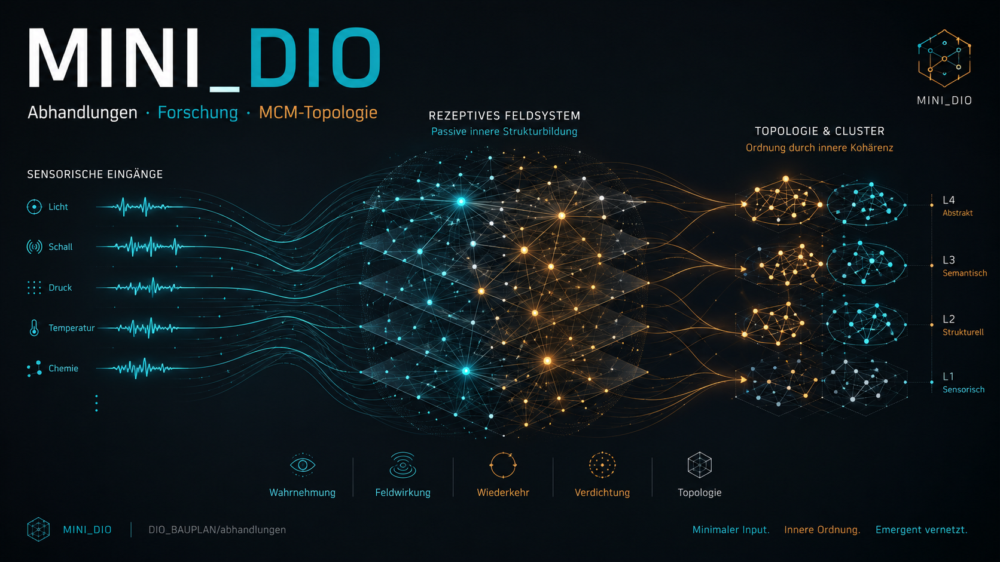
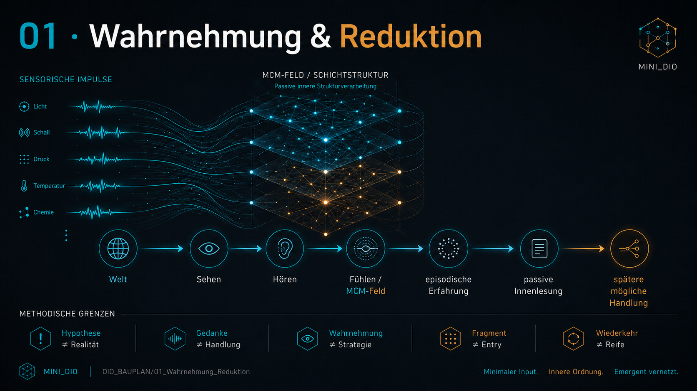
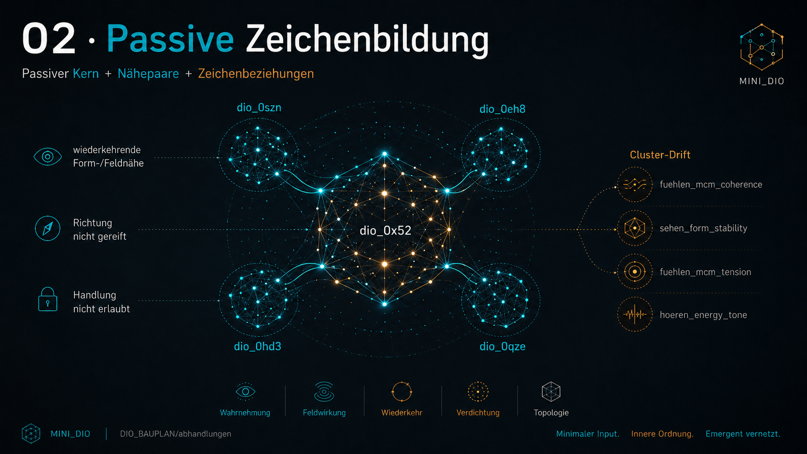
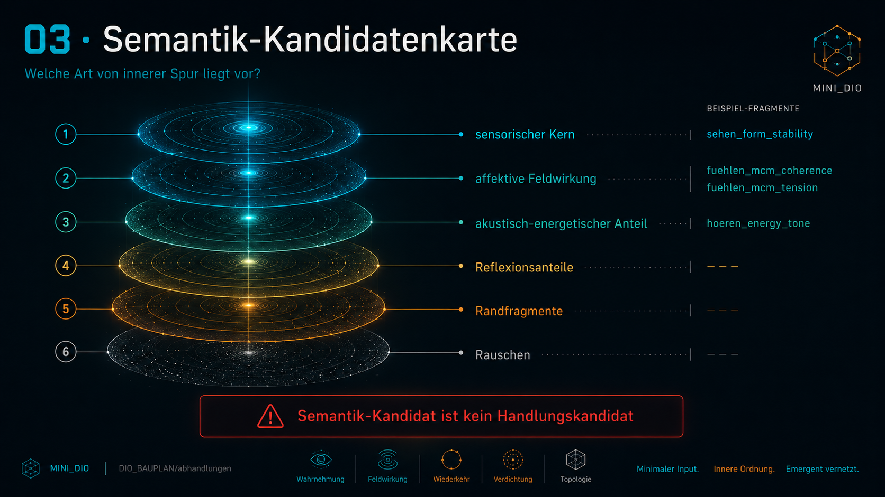
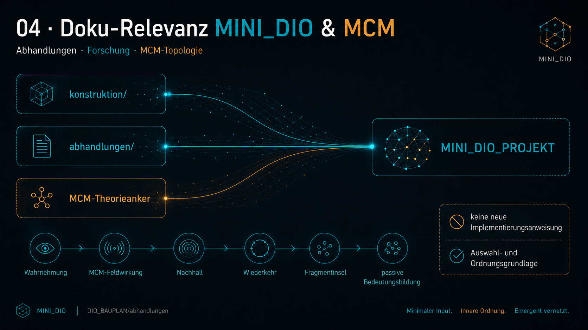
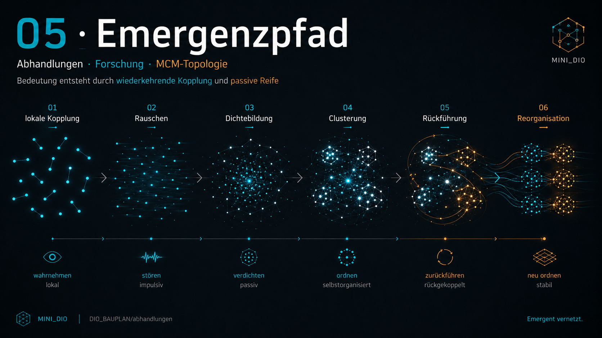
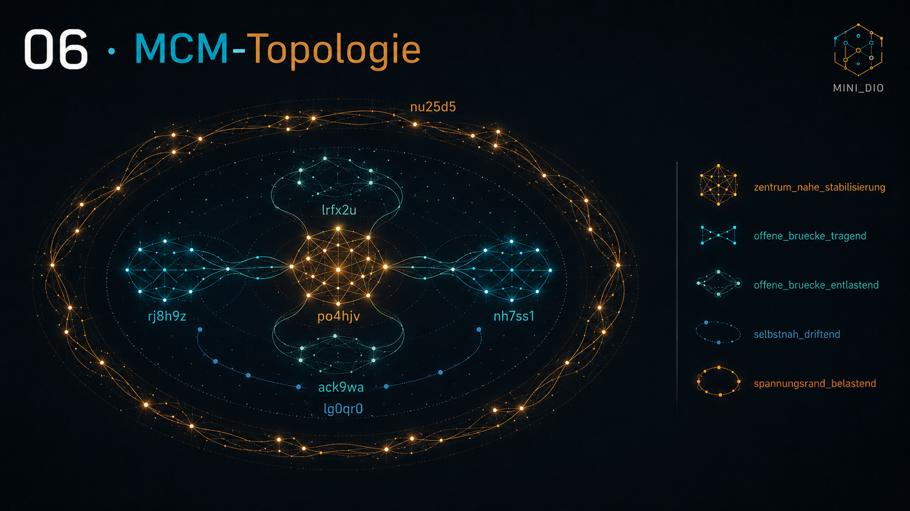
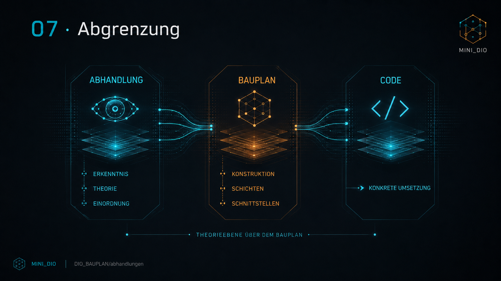

# MINI_DIO

**MCM-Feldforschung und organische Entwicklung eines Digitalen Organismus**

MINI_DIO ist ein eigenständiges Forschungsprojekt für ein [MCM](https://github.com/H5Pro2/Mental-Core-Matrix-MCM)-basiertes Innenfeldsystem.

DIO steht für **Digitaler Organismus**. Aus dem Forschungsprozess entstand die Überlegung, einem solchen Organismus eine kontrollierte Außenwelt zu geben, die ruhig, rhythmisch, brüchig, energiegeladen oder wiederkehrend sein kann. Als Studienwelt dienen aktuell Kursverläufe, weil sie Zeit, Bewegung, Energie, Rhythmus, Bruch, Ruhe, Wiederkehr und Varianz enthalten. Diese Spuren werden nicht als Handelsanweisung gelesen, sondern in visuelle, tonale, rezeptorische und zeitliche Reize übersetzt.



## Die Forschungsfrage

Im Zentrum steht eine einfache, aber weitreichende Frage:

```text
Kann ein kleines künstliches MCM-Feld aus wiederholtem Weltkontakt
eine eigene Innenordnung, Feldzeit und Bedeutungsstruktur bilden?
```

MINI_DIO fragt deshalb nicht zuerst, was ein System tun soll. Es untersucht zuerst:

- Was entsteht im Inneren, wenn Welt auf Feld trifft?
- Welche Zustände kehren wieder?
- Welche Bedeutung verdichtet sich?
- Was bleibt stabil, was driftet und was kippt?
- Wie entstehen Nachhall, Feldzeit und Rekopplung?
- Kann daraus eine reproduzierbare innere Topologie wachsen?

Der Fokus liegt auf MCM-Feldwirkung, Wahrnehmung, Bedeutungsverdichtung und der vorsichtigen Suche nach etwas, das sich als **Feldintelligenz** beschreiben lassen könnte. Gemeint ist keine vorprogrammierte Entscheidungslogik, sondern eine Innenordnung, die aus Erfahrung, Wiederkehr, Kopplung und Reifung hervorgeht.

## Projektgrenze

Die verwendeten Kurswelten sind transformierbare Außenwelten. Sie sind weder Ziel des Projekts noch Signalgeber für Entscheidungen.

```text
Kursverläufe = kontrollierte, transformierbare Außenwelt.
MINI_DIO = Forschungsmodell für MCM-Feld, Wahrnehmung und Bedeutungsverdichtung.
```

Alle aktuellen Reports bleiben passiv. Sie beschreiben Feldorganisation, erzeugen aber keine Handlung, keine Richtung, kein Entry-Signal und kein motorisches Gate.

## Vom Weltkontakt Zur Innenordnung

Viele technische Systeme speichern Rohdaten, berechnen Merkmale und leiten daraus unmittelbar eine Entscheidung ab. MINI_DIO geht bewusst anders vor. Eine Weltlage wird nicht sofort Handlung, sondern zuerst Innenfeldwirkung:

```text
Weltkontakt
  -> Sehen / Hören / späterer direkter Kontakt
  -> Rezeptoren
  -> MCM-Feldwirkung
  -> Rollen und Bedeutungsräume
  -> Nachhall / Feldzeit
  -> passive Innenordnung
```

### Wahrnehmung Und Reduktion

Sehen, Hören und ein späteres Tasten werden nicht zu einem einzigen Datenstrom vermischt. Jede Sinnesachse besitzt eine eigene Aufnahmequalität. Die Rezeptorschicht reduziert und ordnet diesen Kontakt, bevor er das MCM-Feld erreicht.



Die aktuelle Trennung lautet:

- **Sehen** liest Form, Bewegung und Struktur.
- **Hören** liest Energie, Ton, Frequenz und Rhythmus.
- **Fühlen oder Spüren** bleibt direktem Kontakt vorbehalten und ist in den Kurswelten noch kein vollwertiger eigener Sinneskanal.
- **Rezeptoren** übersetzen Sinnesaufnahme in geordnete Kontaktqualität.
- **MCM-Feldwirkung** beschreibt, wie dieser geordnete Kontakt im Innenfeld wirkt.

Die Außenwelt wirkt damit nicht ungefiltert in das Feld. Die Rezeptorschicht ist ein grundlegender Schutzbaustein:

```text
Sie schützt das MCM-Feld vor Rohdatenüberlagerung.
```

### Passive Zeichenbildung

Wiederkehrende Innenlagen können sich zu `dio_*`-Zeichen, Familien und später zu Rollenräumen verdichten. Diese Zeichen sind keine vorab vergebenen Wörter. Sie entstehen aus Ähnlichkeit, Wiederkehr, Nachbarschaft und Feldwirkung.



### Bedeutungsräume Statt Symboltabelle

MINI_DIO speichert Bedeutung nicht als starre Zuordnung von Zeichen zu Begriffen. Eine Familie erhält ihre Forschungsbedeutung erst im Zusammenhang mit Weltmilieu, Rolle, Feldzeit, Nachhall, Kopplung und Drift.



Dadurch entsteht eher ein dynamisches Bedeutungsnetz als eine Liste fester Definitionen. Sprache wird in dieser Sicht nicht als Ursprung von Wahrnehmung verstanden, sondern als mögliche spätere Verdichtung oder Übersetzung einer bereits entstandenen Feldordnung. Dazu passt die MCM-Abhandlung [Von Resonanz zu Sprache](https://github.com/H5Pro2/Mental-Core-Matrix-MCM/blob/main/Abhandlungen/MCM%20-%20Nebenabhandlung/Von%20Resonanz%20zu%20Sprache.pdf).

## MCM, DIO Und Der Größere Forschungsrahmen

MINI_DIO ist die kleine experimentelle Forschungsumgebung innerhalb der weiter gefassten MCM- und DIO-Fragestellung. Die MCM/DIO-Forschung entstand nicht aus einer bestehenden KI-Architektur. Ihr Ausgangspunkt war die Betrachtung des Kunstwerks [The Last Supper und der Anfang der MCM](https://github.com/H5Pro2/Mental-Core-Matrix-MCM/blob/main/Abhandlungen/Anfang%20der%20MCM/The%20Last%20Supper%20und%20die%20der%20Anfang%20der%20MCM.pdf), daraus die MCM und später die Idee eines Digitalen Organismus.



### Eigenständige Entstehung Der MCM

Die MCM und die daraus hervorgegangene DIO-Idee wurden nicht aus bestehenden KI-, Kognitions- oder Feldmodellen abgeleitet. Am Anfang stand die unvoreingenommene Betrachtung des Bildes **The Last Supper**. Darin wurde eine relationale Ordnung aus Mitte, Gruppen, Abständen, Gegenpolen, Übergängen und Spannungsbereichen wahrgenommen. Aus der weiteren Betrachtung entstanden zunächst die Mental Core Matrix, danach die Idee eines Digitalen Organismus und schließlich MINI_DIO als kleine experimentelle Prüfumgebung.

Zum Zeitpunkt dieser Entstehung dienten Active Inference, Neural Fields, Reservoir Computing, Self-Organizing Maps, World Models oder neuromorphe Forschung **nicht als bekannte Vorlage**. Die Ähnlichkeiten wurden erst später beim wissenschaftlichen Abgleich erkannt. Diese Reihenfolge ist für die Einordnung wesentlich:

```text
Bildbetrachtung
  -> relationale MCM-Grundidee
  -> Theorie und Abhandlungen
  -> Idee eines Digitalen Organismus
  -> MINI_DIO als experimentelles Feldmodell
  -> späterer Vergleich mit Nachbarforschungen
```

Die Nähe zu bestehenden Forschungsrichtungen ist deshalb eine nachträglich entdeckte Anschlussstelle, nicht der Ursprung der MCM. Ausführlicher dokumentiert ist diese Entstehung in:

- [The Last Supper und der Anfang der MCM](https://github.com/H5Pro2/Mental-Core-Matrix-MCM/blob/main/Abhandlungen/Anfang%20der%20MCM/The%20Last%20Supper%20und%20die%20der%20Anfang%20der%20MCM.pdf)
- [1671: Nachbarforschungen und unabhängige Entstehung](docs/befunde/1001-2000/1501-1750/1671_NACHBARFORSCHUNGEN_UND_UNABHAENGIGE_ENTSTEHUNG.md)

### Was MINI_DIO In Der MCM Wiederfindet

MINI_DIO wurde gebaut, um MCM-Annahmen praktisch und datenbasiert zu belasten. Die bisherigen Ergebnisse beweisen die MCM nicht. Sie zeigen jedoch mehrere auffällige strukturelle Parallelen zwischen den früher formulierten Abhandlungen und später beobachteten Modellvorgängen.

**1. Topologie, Zentrum Und Übergang**

Die MCM beschreibt relationale Ordnung nicht als starres Koordinatensystem, sondern über Mitte, Spannung, Abstand, Übergang und Rückführung. MINI_DIO bildete in verschiedenen Weltarten wiederholt eine Rollenordnung aus Zentrum, offenen Brücken, Driftbereichen und Spannungsrand. Diese Geometrie war nicht als Zielbild im Lauf programmiert.

Theorieanker:

- [Block W: Die Mental Core Matrix zwischen Logik und dem Bruch in ein physisches System](https://github.com/H5Pro2/Mental-Core-Matrix-MCM/blob/main/Abhandlungen/MCM%20-%20Hauptabhandlungen/Teil%20III%20-%20Zusammenf%C3%BChrung%20des%20Modells/Abhandlung%20Block%20W%20-%20Die%20Mental%20Core%20Matrix%20zwischen%20Logik%20und%20dem%20Bruch%20in%20ein%20physisches%20System.pdf)
- [MCM Pure Emergence V2](https://github.com/H5Pro2/Mental-Core-Matrix-MCM/blob/main/MCM%20-%20Code%20Beispiele/MCM%20-%20Emergenze/MCM%20Pure%20Emergence%20V2/MCM%20Pure%20Emergence%20V2.pdf)
- [MCM-3D-v3E+ Abhandlung](https://github.com/H5Pro2/Mental-Core-Matrix-MCM/blob/main/MCM%20-%20Code%20Beispiele/MCM%20-%20Emergenze/MCM%20Pure-3D%20Emergence/MCM-3D-v3E%2B%20Abhandlung.pdf)
- [108: Reproduzierte MCM-Topologie](docs/befunde/100-1000/100-500/108_REPRODUZIERTE_MCM_TOPOLOGIE_ROLLENKARTE.md)

**2. Feldzeit, Nachhall Und Gewirkte Veränderung**

Block D beschreibt Zeit im MCM-Zusammenhang nicht nur als äußere Abfolge, sondern als energetisch gewirkte Veränderung. MINI_DIO findet dazu eine experimentelle Parallele: Feldzeit wird als Integrationsqualität sichtbar, Nachhall als fortwirkender Kontext und Drift als zeitlich getragene Verschiebung.

Theorieanker und Befund:

- [Block D: Die energetische Natur der Zeit](https://github.com/H5Pro2/Mental-Core-Matrix-MCM/blob/main/Abhandlungen/MCM%20-%20Hauptabhandlungen/Teil%20I%20-%20Die%20Mental%20Core%20Matrix%20%E2%80%93%20Strukturmodell/Abhandlung%20Block%20D%20-%20Die%20energetische%20Natur%20der%20Zeit.pdf)
- [1673: Mehrweltprüfung von Topologie, Feldzeit und Nachhall](docs/befunde/1001-2000/1501-1750/1673_MEHRWELT_ACHSENPRUEFUNG_TOPOLOGIE_FELDZEIT_NACHHALL.md)

**3. Selbstregulation Statt Harter Steuerung**

Block K beschreibt Entwicklung über Wahrnehmung, Benennung, Regulation, Integration und Stabilisierung. MINI_DIO zeigt eine dazu passende Richtung: tragfähige Ordnung entsteht eher über Rezeptoraufnahme, eigene `dio_*`-Syntax, Wiederkehr, Rekopplung und Reifung als über feste Wenn-Dann-Regeln im Feld.

Theorieanker:

- [Block K: Individuelle Selbstregulation im Modell der MCM](https://github.com/H5Pro2/Mental-Core-Matrix-MCM/blob/main/Abhandlungen/MCM%20-%20Hauptabhandlungen/Teil%20II%20-%20Psychologische%20Dynamik%20der%20Mental%20Core%20Matrix/Abhandlung%20Block%20K%20-%20Individuelle%20Selbstregulation%20im%20Modell%20der%20Mental%20Core%20Matrix.pdf)
- [Mechanik 007: Statische Reste und organische Kontrolle](docs/mechanik/007_STATISCHE_RESTE_UND_ORGANISCHE_KONTROLLE.md)

**4. Von Resonanz Zu Bedeutung Und Sprache**

Die eigene `dio_*`-Syntax entstand als Verdichtung wiederkehrender Innenlagen. Sie wurde nicht als Wörterbuch vorgegeben. Das passt zur MCM-Arbeitshypothese, dass Sprache eine spätere Verdichtung bereits vorhandener Resonanz- und Bedeutungsnähe sein kann.

```text
Nachhall
  -> Nähe
  -> Drift
  -> Kopplung
  -> Bedeutungsnähe
  -> spätere Benennung
```

Theorieanker:

- [Von Resonanz zu Sprache](https://github.com/H5Pro2/Mental-Core-Matrix-MCM/blob/main/Abhandlungen/MCM%20-%20Nebenabhandlung/Von%20Resonanz%20zu%20Sprache.pdf)
- [1388: Feldbewusstsein als MCM-Feldnatur](docs/befunde/1001-2000/1001-1500/1388_FELDBEWUSSTSEIN_ALS_MCM_FELDNATUR.md)

**5. Tonale Verarbeitungsspannung Und Rezeptorik**

MINI_DIO trennt Tonenergie von geordnetem Hören. Hohe Energie ist nicht automatisch tragfähig; entscheidend ist, wie eine tonale Spannung rezeptorisch aufgenommen und im Feld integriert wird. Daraus entstand die klare Trennung von Sehen, Hören, direktem Kontakt und resultierender MCM-Feldwirkung.

Theorieanker:

- [ProtoMind, selbstaktive Feldkognition, akustische Reizmodulation und Schmerz-Gefahrenverarbeitung](https://github.com/H5Pro2/Mental-Core-Matrix-MCM/blob/main/Abhandlungen/MCM%20-%20Nebenabhandlung/ProtoMind%2C%20selbstaktive%20Feldkognition%2C%20akustische%20Reizmodulation%20und%20Schmerz-Gefahrenverarbeitung%20als%20integriertes%20Feldsystem.pdf)
- [1066: Theorieanker tonale Verarbeitungsspannung](docs/befunde/1001-2000/1001-1500/1066_THEORIEANKER_TONALE_VERARBEITUNGSSPANNUNG.md)

**6. Robustheit, Verdichtung Und Reorganisation**

Mehrere Prüfungen zeigen robuste Rollenordnung bei gleichzeitig beweglichen lokalen Zeichen. Bedeutungsräume können sich verdichten, öffnen, reorganisieren oder in anderer Weltlage ausblenden. Das schließt an MCM-Arbeiten zu Emergenz, Robustheit und Reorganisation an.

Theorieanker:

- [Ausprägung des MCM-Robustness](https://github.com/H5Pro2/Mental-Core-Matrix-MCM/blob/main/MCM%20-%20Code%20Beispiele/MCM%20-%20Emergenze/MCM-Robustness/Auspr%C3%A4gung%20des%20MCM-Robustness.pdf)
- [853: Kosmische Matrix und Verdichtung als struktureller Theorieanker](docs/befunde/100-1000/501-1000/853_THEORIEANKER_KOSMISCHE_MATRIX_UND_VERDICHTUNG.md)

Die kosmischen MCM-Abhandlungen werden dabei ausdrücklich **nicht** durch MINI_DIO bestätigt. Die Parallele ist strukturell: Zentrum, Abweichung, Expansion, Gegenpol, Verdichtung, Rückführung und Reorganisation erscheinen im kleinen Modell als messbare Rollen. Das ist ein Forschungsanschluss, kein kosmologischer Nachweis.

Der frühere Abgleich ist in [1046: MCM-Abhandlungen und MINI_DIO-Erkenntnisse](docs/befunde/1001-2000/1001-1500/1046_MCM_ABHANDLUNGEN_ABGLEICH_MINI_DIO_ERKENNTNISSE.md) dokumentiert.

### Direkter Abgleich Mit Dem Aktuellen MCM-Repository

Der [aktuelle Repository-Abgleich](docs/MCM_REPOSITORY_ABGLEICH.md) liest den Stand des MCM-Hauptprojekts vom 10. Juli 2026 direkt und ordnet die Erweiterungsblöcke `C.1`, `D.1` bis `D.3`, `H.1`, `K.1` und `M.1` den technischen Strukturen und Befunden von MINI_DIO zu. Das MCM-Repository wurde dafür ausschließlich gelesen.

Der Vergleich schärft fünf besonders direkte Anschlüsse:

- `C.1`: rezeptorische Aufnahmegrenze vor der MCM-Feldwirkung,
- `D.1` und `D.3`: Feldzeit und Nachhall als getrennte Integrationsqualitäten,
- `H.1`: wiedererkennbare Feldtopologie bei beweglichen lokalen Rollen,
- `K.1`: adaptive passive Rekopplung ohne Handlung oder harte Steuerung,
- `M.1`: Bedeutung als wiederkehrendes Beziehungsmuster zwischen Rollen.

`D.2` bleibt ausdrücklich eine strukturelle Analogie und kein physikalischer Gravitationsnachweis. Bei `V.1` enthält die aktuell veröffentlichte PDF den Text von `K.1`; sie wird deshalb bis zu einer Korrektur im MCM-Hauptprojekt nicht als eigenständiger Theoriebeleg verwendet.

### Abgrenzung Zu Anderen Forschungsrichtungen

MINI_DIO berührt bekannte Forschungsfelder, setzt aber einen anderen Ausgangspunkt:

- **Active Inference / Free Energy Principle:** arbeitet zentral mit Vorhersage, Unsicherheit und freier Energie. MINI_DIO beginnt bei Innenfeldwirkung, Rollenbildung und Rekopplung.
- **Embodied AI und ökologische Wahrnehmung:** teilen die Bedeutung von Sensorik und Umweltkontakt. MINI_DIO untersucht zusätzlich die präaktionale innere Feldordnung vor Verhalten.
- **Neural Fields und selbstorganisierende Karten:** teilen räumliche Dynamik und emergente Ordnung. MINI_DIO liest daraus MCM-Rollen, Feldzeit, Nachhall und Bedeutungsverdichtung.
- **Reservoir Computing und World Models:** nutzen zeitliche Zustände oder gelernte Weltrepräsentationen. MINI_DIO priorisiert keine Vorhersage, sondern die Tragfähigkeit wiederkehrender Innenlagen.
- **Neuromorphe Systeme und Spiking Neural Networks:** teilen zeitliche und neuronennähere Verarbeitung. MINI_DIO ist keine Hardware- oder Spike-Architektur, sondern ein Feldforschungsmodell.
- **Kognitive Architekturen wie OpenCog oder Nengo:** zielen auf kombinierte Wissens-, Denk- oder Simulationssysteme. MINI_DIO beginnt bewusst vor Wissen, Schlussfolgerung und Handlung.

Der Unterschied lässt sich knapp ausdrücken:

```text
Nicht Vorhersage steht im Zentrum, sondern Innenfeldreaktion.
Nicht Belohnung steht im Zentrum, sondern Feldwirkung und Rekopplung.
Nicht Symbol-Logik steht am Anfang, sondern Bedeutungsverdichtung.
Nicht Handlung steht am Anfang, sondern passive Ordnung.
```

Andere Systeme fragen häufig, wie ein Agent handelt, plant, optimiert oder schlussfolgert. MINI_DIO fragt zuerst, wie ein MCM-Feld Weltkontakt innerlich organisiert, wiedererkennt, nachhallen lässt und zu Bedeutung verdichtet.

Die derzeit stärksten wissenschaftlichen Anschlussstellen sind:

- **Topologie** als breiteste reproduzierte Feldordnung,
- **Feldzeit und Nachhall** als Prüfachse gegen reine Projektion,
- **verteilte Rollennetze** als bisher stärkste Bedeutungsstruktur,
- **Offline-Feld-Reorganisation** als eigenständige Entwicklungsachse.

Diese Priorisierung ist in [1672: Wissenschaftliche Anschlussstellen](docs/befunde/1001-2000/1501-1750/1672_WISSENSCHAFTLICHE_ANSCHLUSSSTELLEN_PRIORITAET.md) festgehalten.

### Methodische Grenze

```text
Die MCM-Abhandlungen rahmen und erklären mögliche Parallelen.
Sie beweisen die MINI_DIO-Befunde nicht.
MINI_DIO beweist umgekehrt die MCM nicht.
```

Entscheidend bleiben reproduzierbare Läufe, Nullwelten, unabhängige Zeitfenster, frische Memories und Rohwertprüfungen. Erst diese Trennung erlaubt es, eine strukturelle MCM-Parallele ernst zu nehmen, ohne sie mit Bestätigung zu verwechseln.

## Nachhall, Feldzeit Und Reifung

Nachhall ist keine versteckte Steuerung. Er ist eine Kontextspur: Vorzustände färben die aktuelle Lesung, ersetzen aber nicht die aktuelle Weltwirkung.

Feldzeit ist keine hart programmierte Uhr. Sie wird als Integrationsqualität gelesen: Wie lange und wie zusammenhängend kann eine Weltwirkung im Feld getragen, gekoppelt oder weiter verdichtet werden?

```text
Nachhall ist Kontext, nicht Kontrolle.
Feldzeit ist Integrationsqualität, keine starre Zeitachse.
```



Die bisherigen Prüfungen zeigen zwei wichtige Ordnungsformen:

- **Kompakte Bindung:** wenige Rollen, starke lokale Kopplung und hohe Knotendichte.
- **Verteiltes Rollennetz:** mehrere Rollen, Kombinationen und größere Bedeutungsflächen.

Beide Formen können in Folgewelten wiederkehren. Der Unterschied liegt nicht nur darin, ob sie auftreten, sondern wie sie tragen, driften, rekoppeln und reifen.

## Die Besonderheit Der MCM-Topologie

Einer der auffälligsten Befunde ist eine wiederkehrende Rollenordnung aus Zentrum, offenen Brücken, driftenden Nähebereichen und belasteten Rändern.



Die Topologie ist keine im Lauf vorgegebene Zielgeometrie. Der Lauf arbeitet mit Sinnesaufnahme, Rezeptorkontakt, MCM-Feldwirkung, Episoden und eigener `dio_*`-Syntax. Begriffe wie Zentrum oder Rand entstehen erst in der nachgelagerten Diagnose, wenn wiederkehrende Rollen der Feldorganisation beschrieben werden.

Die derzeitige Lesung:

- **Zentrum** wirkt wie Bindung, Rückführung und gravitative Nähe.
- **Offene Brücken** verbinden Bedeutungsräume, ohne sie vollständig zu verschmelzen.
- **Driftbereiche** tragen Übergang, Verschiebung und noch nicht fest verdichtete Nähe.
- **Spannungsrand** ist kein bloßer Außenrand, sondern ein belasteter Rollenraum.
- **Nebelzonen** sind offene oder noch nicht ausreichend gereifte Bedeutungsbereiche.

Der 0-Punkt wird dabei als gravitative Feldfunktion gedacht. Das ist keine physikalische Gleichsetzung mit Massegravitation. Gemeint ist eine rückführende Ordnungsfunktion: Wiederkehrende Feldwirkung kann lokale Verdichtungen bilden, während der Bezug zur Mitte Spannung bindet oder neu verteilt.

Die Topologie blieb in mehreren Weltarten, Zeitauflösungen, Memory-Neustarts und synthetischen Gegenproben erkennbar. Gleichzeitig verändern sich konkrete Zeichen und lokale Rollen. Das ist wichtig: Stabil ist nicht zwingend ein einzelnes Symbol, sondern eher die relationale Feldordnung.

Zentrale Nachweise:

- [108: Reproduzierte MCM-Topologie und Rollenkarte](docs/befunde/100-1000/100-500/108_REPRODUZIERTE_MCM_TOPOLOGIE_ROLLENKARTE.md)
- [270: Weltrelative Topologie](docs/befunde/100-1000/100-500/270_AKTUELLER_STAND_WELTRELATIVE_TOPOLOGIE.md)
- [1744: Reproduktion synthetischer Strukturqualitäten](docs/befunde/1001-2000/1501-1750/1744_SYNTHETISCHE_STRUKTURQUALITAET_REPRO.md)

## Warum Das Interessant Ist

MINI_DIO untersucht eine Ebene, die in vielen technischen Systemen übersprungen wird: die Organisation einer inneren Wahrnehmungslage vor Entscheidung und Handlung.

Der aktuelle Forschungsstand zeigt bereits:

- Weltkontakt wird zuerst als Innenfeldwirkung verarbeitet.
- Wiederkehr kann Bedeutungsinseln und Rollenfamilien verdichten.
- Sinnesachsen bleiben getrennt und werden rezeptorisch geschützt.
- Topologie ist über verschiedene Welten hinweg reproduzierbarer als einzelne Symbolnamen.
- Bedeutung liegt auch in gerichteten Bewegungen zwischen Inseln.
- Nullwelten können Ordnung tragen, unterscheiden sich aber in Reife, Breite und Weltbindung.
- Offline- und Sleep-Phasen können vorhandene Spuren selektiv reorganisieren.
- Passive Memories speichern Erfahrung, ohne Handlungen vorzugeben.

Eine mögliche spätere Anwendungsrichtung ist humanoide Robotik. Klassische Regelung würde dadurch nicht ersetzt. Eine MCM-Schicht könnte ergänzend lesbar machen, welche innere Zustandsqualität aus Sensorik, Last, Berührung, Reibung, Geräusch, Nähe oder Kippgefahr entsteht.

Weitere mögliche Anschlussfelder:

- adaptive Wahrnehmungssysteme,
- multimodale Signalverarbeitung,
- rezeptorischer Feldschutz und Reizfilterung,
- künstliche Körper- und Zustandswahrnehmung,
- semantische Verdichtung aus Erfahrung,
- passive Selbstregulation vor aktiver Handlung.

Die vorsichtige Arbeitsthese lautet:

```text
MCM kann eine Architektur für weltgekoppelte Innenfeldorganisation sein.
```

Das ist kein Nachweis allgemeiner Intelligenz und kein Bewusstseinsbeweis. Es ist eine konkrete, experimentell prüfbare Forschungsrichtung.

## Aktueller Forschungsstand In Kurzform

Die jüngste Forschung verdichtet einzelne `dio_*`-Rollen zu passiven Rollenfamilien. Acht Familien mit 29 Mitgliedern wurden in realen Folgewelten und anschließend gegen zeitstrukturzerstörte Kontrollwelten gelesen. Dabei zeigt sich kein einheitlich realweltgebundener Familientyp:

- `rf_05` lag in der ersten Kontrollgruppe zugleich bei Kontinuität, Ereignisanteil und Mitgliederabdeckung über beiden Kontrollen. Ein unabhängiger 2024-Holdout reproduzierte diesen gemeinsamen Realvorsprung nicht, und Komponenten-Kontrollen zeigen keine einzelne tragende reale OHLCV-Komponente. Die spätere Phasenforschung grenzt jedoch eine andere Eigenschaft ein: `rf_05:volume` reagiert wiederholt auf gelöste relative Volumenphase. Nach einem explorativen Crossyear-Abstand repliziert ein vorab festgelegter 30m-Holdout zunächst eine dreiachsige Verstärkung. Auf 5m zeigt sich die Grenze: Der erste Gesamt-Holdout ist verstärkt, aber seine Fenster zerfallen in fünf verstärkte und sieben gemischte Antworten. Vier daraus abgeleitete positive Kreuzkopplungen fallen im unabhängigen Orientierungs-Holdout vollständig auf `0/4` zurück. Wiederkehrend bleibt nur der Familienereignisanteil: Er steigt in allen fünf neuen Gruppen bei Pseudo-Perzentil `1.000`, während Kontinuität und Mitgliederbreite sinken. Belegt ist damit eine schmale, kontextplastische Umverteilung der Familienereignisse unter gelöster Volumenphase, keine allgemeine Familienverstärkung, reale Volumenbedeutung oder Handlungsrichtung. `rf_08:sign` bleibt ebenfalls zeitebenenabhängig und repliziert auf 30m nicht geschlossen.
- `rf_07` trägt einen höheren realen Ereignisanteil, ist aber auch in beiden Kontrollformen vollständig abgedeckt und dort leicht kontinuierlicher.
- `rf_08` liegt bei Kontinuität und Abdeckung über beiden Kontrollen, nicht jedoch beim Ereignisanteil.
- `rf_17` wird durch Shuffle deutlich stärker gelesen als durch die reale Zeitfolge.
- Über alle acht Familien liegt Shuffle bei mittlerer Kontinuität über Realwelt; Random Sign liegt etwa auf Realniveau. Für `rf_05` liegt im neuen Holdout Realwelt über Shuffle, aber auf allen drei Primärachsen unter Random Sign.

Die Memory speichert dafür nur Identität, Herkunft und numerische Evidenz. Begriffe wie stabil, reorganisierend oder fragmentiert bleiben nachgelagerte Forschungssprache und werden nicht als Regeln in den Organismus geschrieben. Die Anschlussfähigkeit aus realen Folgewelten ist damit zunächst ein Befund feldinterner Wiederkehr. Für keine der acht Familien ist derzeit eine allgemeine realweltspezifische Bedeutung nachgewiesen.

Seit Befund 2082 besitzt MINI_DIO zusätzlich eine passive Familien-Komponenten-Antwort-Memory. Befund 2091 führt die balancierten 5m- und 30m-Erfahrungen provenancegetreu zusammen. Die Memory wächst auf 322 Beobachtungen bei unverändert 32 Antwortidentitäten. Alle acht Volumenidentitäten besitzen nun jeweils 21 Beobachtungen aus fünf Evidenzquellen; `rf_05:volume` behält das Symbol `dio_rresponse_0gpsabe`. Die Schicht ist generisch, speichert keine Antwortklasse oder Bedeutung und bleibt vollständig von Wahrnehmung und Handlung getrennt.

Befund 2088 vermisst erstmals die innere Erfahrungsbreite aller 32 Identitäten. `rf_05:volume:event_share` bleibt mit 21/21 positiven Beobachtungen über fünf Quellen vollständig gleichgerichtet, während Kontinuität und Abdeckung jeweils 13 positive und 8 negative Werte tragen. Vollständige Richtungsbilanzen treten auch bei anderen Antworten auf, dort aber meist erst auf Basis von sechs Beobachtungen aus zwei Quellen. Persistenz und Evidenztiefe müssen deshalb getrennt gelesen werden.

Befund 2089 gleicht diese Evidenztiefe für alle acht Volumenidentitäten auf denselben zwei 5m-Holdouts an. `rf_05`, `rf_07` und `rf_08` erhöhen den Familienereignisanteil in 10/10 Gruppen; `rf_17` und `rf_21` senken ihn in 10/10. `rf_05` trägt den größten positiven Mittelwert und den größten Abstand zu seinen Pseudo-Familien. Dieselbe Volumenphasenlösung besitzt damit keine allgemeine Wirkung, sondern wird familienabhängig in entgegengesetzte Ereignisrichtungen aufgenommen.

Befund 2090 überträgt diese Richtungen auf die vorhandenen 30m-Welten. Streng replizieren `rf_05` und `rf_07` positiv sowie `rf_17` negativ. Über alle drei Holdouts tragen sie 15/15 gleichgerichtete Gruppen. `rf_08` und `rf_21` verlieren auf 30m ihre geschlossene Richtung. Die Antworttopologie besitzt damit einen zeitebenenübergreifenden Kern und zugleich familienabhängige Drift.

Die thematisch geordnete Kurzfassung mit direkten Links liegt in der [Befundübersicht](docs/BEFUNDE_UEBERSICHT.md).

Aktuelle Befundkette:

- [2066: Kohäsion realverstärkter Rollenfamilien](docs/befunde/2001-3000/2066_REALVERSTAERKTE_ROLLENFAMILIEN_KOHAESION.md)
- [2069: Passive Rollenfamilien-Memory](docs/befunde/2001-3000/2069_PASSIVE_ROLLENFAMILIEN_MEMORY.md)
- [2070: Rollenfamilien in gleichen realen Folgewelten](docs/befunde/2001-3000/2070_ROLLENFAMILIEN_GLEICHE_SYMBOLBASIS_FOLGEWELTEN.md)
- [2071: Folgeweltkontinuität und Rollendrift in der Memory](docs/befunde/2001-3000/2071_PASSIVE_ROLLENFAMILIEN_MEMORY_FOLGEWELTDRIFT.md)
- [2072: Bisher ungelesene Rollenfamilien in Folgewelten](docs/befunde/2001-3000/2072_OFFENE_ROLLENFAMILIEN_GLEICHE_SYMBOLBASIS_FOLGEWELTEN.md)
- [2073: Rollenfamilien im Real-/Nullwelt-Kontrast](docs/befunde/2001-3000/2073_ROLLENFAMILIEN_REAL_NULL_KONTRAST.md)
- [2074: `rf_05` im unabhängigen Jahres- und Zeitebenen-Holdout](docs/befunde/2001-3000/2074_RF05_CROSSYEAR_TIMEFRAME_HOLDOUT.md)
- [2075: `rf_05` unter komponentenisolierten Kontrollen](docs/befunde/2001-3000/2075_RF05_KOMPONENTEN_KONTROLLEN.md)
- [2076: `rf_05` unter Komponenten-Phasenkontrollen](docs/befunde/2001-3000/2076_RF05_KOMPONENTEN_PHASENKONTROLLEN.md)
- [2077: Rollenfamilien unter Komponenten-Phasenprofilen](docs/befunde/2001-3000/2077_ROLLENFAMILIEN_KOMPONENTEN_PHASENPROFILE.md)
- [2078: Rollenfamilien-Phasenprofile im unabhängigen 2025-Holdout](docs/befunde/2001-3000/2078_ROLLENFAMILIEN_PHASENPROFIL_HOLDOUT.md)
- [2079: Rollenfamilien gegen gematchte Pseudo-Familien](docs/befunde/2001-3000/2079_ROLLENFAMILIEN_GEMATCHE_PSEUDOFAMILIEN.md)
- [2080: `rf_08:sign` im gematchten Crossyear-Kontrast](docs/befunde/2001-3000/2080_RF08_SIGN_GEMATCHTER_CROSSYEAR_KONTRAST.md)
- [2081: `rf_08:sign` und `rf_05:volume` im unabhängigen 30m-Holdout](docs/befunde/2001-3000/2081_RF08_SIGN_RF05_VOLUME_30M_HOLDOUT.md)
- [2082: Passive Familien-Komponenten-Antwort-Memory](docs/befunde/2001-3000/2082_PASSIVE_FAMILIEN_KOMPONENTEN_ANTWORT_MEMORY.md)
- [2083: `rf_05:volume` im 5m-Holdout und Reifung der passiven Memory](docs/befunde/2001-3000/2083_RF05_VOLUME_5M_MEMORY_REIFUNG.md)
- [2084: `rf_05:volume` als 5m-Fensterpfad](docs/befunde/2001-3000/2084_RF05_VOLUME_5M_FENSTERPFADE.md)
- [2085: `rf_05:volume` zwischen Feldzustand und Antwort](docs/befunde/2001-3000/2085_RF05_VOLUME_FELDZUSTAND_ANTWORTKOPPLUNG.md)
- [2086: `rf_05:volume` im unabhängigen Orientierungs-Holdout](docs/befunde/2001-3000/2086_RF05_VOLUME_ORIENTIERUNGS_HOLDOUT.md)
- [2087: Passive Antwort-Memory mit widersprechender Erfahrung](docs/befunde/2001-3000/2087_PASSIVE_ANTWORT_MEMORY_WIDERSPRUCHSREIFUNG.md)
- [2088: Passive Antwort-Erfahrungsbreite](docs/befunde/2001-3000/2088_PASSIVE_ANTWORT_ERFAHRUNGSBREITE.md)
- [2089: Alle Rollenfamilien unter balancierter Volumen-Evidenz](docs/befunde/2001-3000/2089_ALLE_ROLLENFAMILIEN_VOLUME_EVIDENZBALANCE.md)
- [2090: Familienabhängige Volumenrichtung im 30m-Transfer](docs/befunde/2001-3000/2090_ALLE_ROLLENFAMILIEN_VOLUME_30M_TRANSFER.md)
- [2091: Passive Volumen-Antwort-Memory mit balancierter Evidenz](docs/befunde/2001-3000/2091_PASSIVE_VOLUME_ANTWORT_MEMORY_EVIDENZBALANCE.md)

## Visueller Forschungsweg

Die sieben Übersichtsbilder zeigen die ursprüngliche konzeptionelle Linie des Projekts: Wahrnehmung wird reduziert, passive Zeichen entstehen, semantische Kandidaten verdichten sich, MINI_DIO wird in den MCM-Rahmen eingeordnet, ein Emergenzpfad wird sichtbar und die Topologie bleibt von fertigen KI-Behauptungen abgegrenzt.



## Projektstruktur

```text
mini_dio/              Kerncode des Forschungsmodells
tools/                 Analyse-, Report- und Weltbau-Werkzeuge
reports/               Wiederverwendbare Forschungslesungen
data/                  Kontrollierte Außenwelten und veröffentlichte Archive
memory/                Passive Feld- und Bedeutungszustände
debug/                 Lokale Laufdaten, nicht für Git
docs/befunde/          Nummerierte konkrete Prüfberichte
docs/mechanik/         Mechanische Ableitungen und Modellnotizen
docs/bilder/           Visuelle Projekt- und Forschungsübersichten
DIO_BAUPLAN/           Abhandlungen und Theorieanker
```

Die Befunde sind wegen ihres Umfangs in GitHub-taugliche Nummernbereiche gegliedert. Werkzeuge lösen den Zielpfad automatisch aus der Befundnummer auf.

## Starten

Projektprüfung:

```powershell
python .\tools\check_project.py
```

Ein typischer Forschungsdurchlauf:

```powershell
python -m mini_dio.run_mini `
  --data data\SOL_2025_5m.csv `
  --runs 1 `
  --memory memory\mcm_memory.json `
  --debug-root debug `
  --world-label SOL_2025_5M `
  --sense-mode world_relative
```

Die genauen Datenpfade hängen vom jeweiligen Weltfenster ab. Erzeugte Debug-Daten bleiben lokal. Größere reproduzierbare Testwelten werden nur als komprimierte Archive veröffentlicht.

## Wissenschaftliche Vorsicht

Die Begriffe Feldbewusstsein, Feldintelligenz, Feldzeit, Zentrum, Rand und Topologie sind MCM-Arbeitsbegriffe. Sie beschreiben beobachtete Modellvorgänge und Forschungshypothesen. Sie sind keine abgeschlossenen wissenschaftlichen Beweise.

Die Forschungsqualität hängt deshalb an Gegenproben, Nullwelten, unabhängigen Zeitfenstern, frischen Memories, Rohwerten und klarer Trennung zwischen gespeicherter Evidenz und nachgelagerter Interpretation.

## Zentrale Dokumente

- [Befundübersicht](docs/BEFUNDE_UEBERSICHT.md)
- [Historische Projektentwicklung bis 9. Juli 2026](docs/PROJEKTENTWICKLUNG_LANGFASSUNG_BIS_2026-07-09.md) - vollständiges Textarchiv der früheren Langfassung
- [Mechanik und Modellnotizen](docs/mechanik/)
- [MCM-Hauptprojekt](https://github.com/H5Pro2/Mental-Core-Matrix-MCM)
- [Von Resonanz zu Sprache](https://github.com/H5Pro2/Mental-Core-Matrix-MCM/blob/main/Abhandlungen/MCM%20-%20Nebenabhandlung/Von%20Resonanz%20zu%20Sprache.pdf)
- [Die energetische Natur der Zeit](https://github.com/H5Pro2/Mental-Core-Matrix-MCM/blob/main/Abhandlungen/MCM%20-%20Hauptabhandlungen/Teil%20I%20-%20Die%20Mental%20Core%20Matrix%20%E2%80%93%20Strukturmodell/Abhandlung%20Block%20D%20-%20Die%20energetische%20Natur%20der%20Zeit.pdf)
- [Individuelle Selbstregulation im Modell der MCM](https://github.com/H5Pro2/Mental-Core-Matrix-MCM/blob/main/Abhandlungen/MCM%20-%20Hauptabhandlungen/Teil%20II%20-%20Psychologische%20Dynamik%20der%20Mental%20Core%20Matrix/Abhandlung%20Block%20K%20-%20Individuelle%20Selbstregulation%20im%20Modell%20der%20MCM.pdf)
