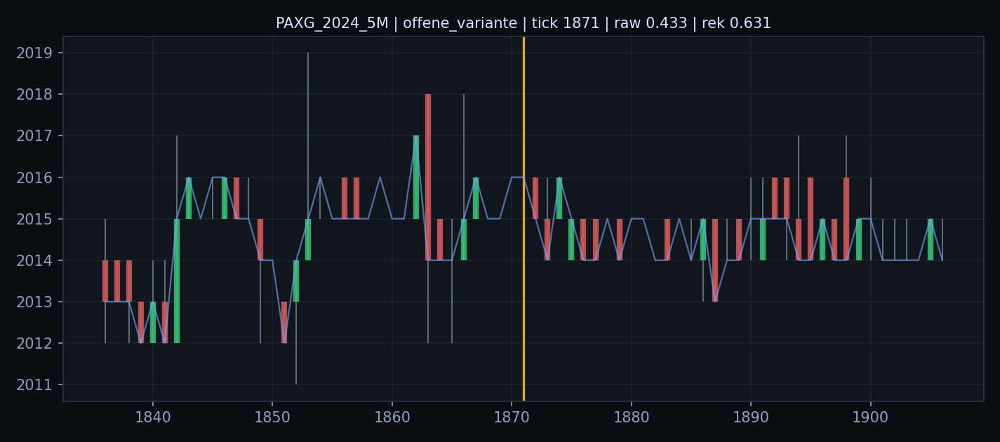
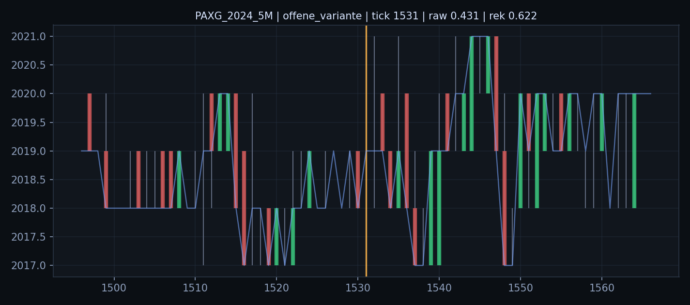
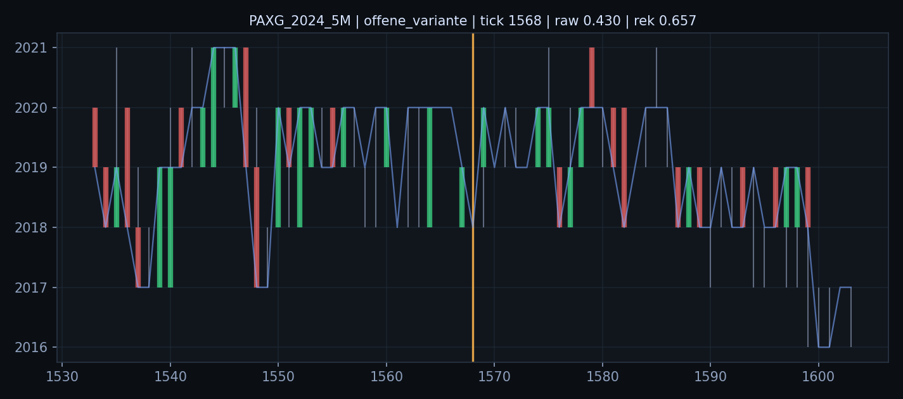
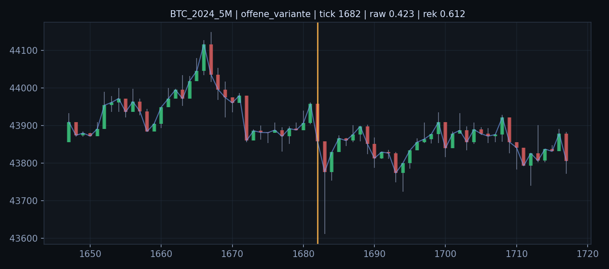
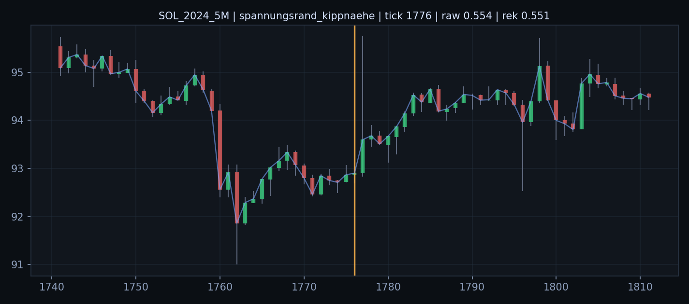
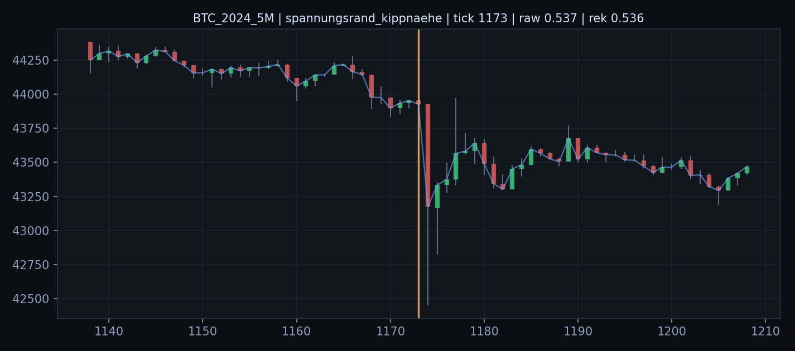
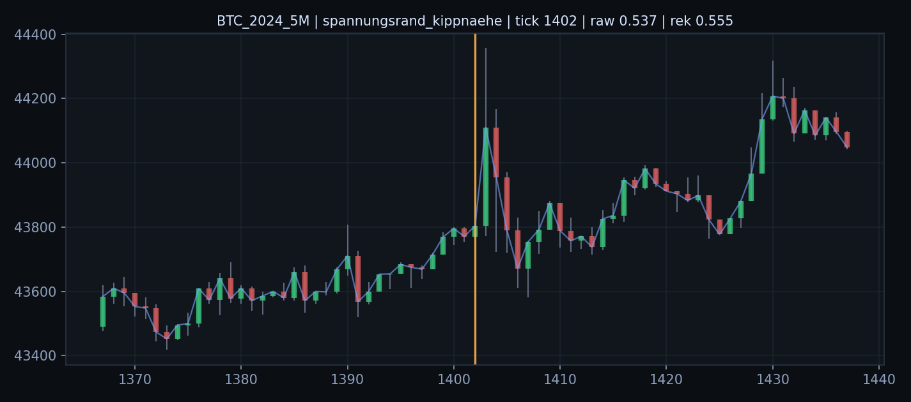
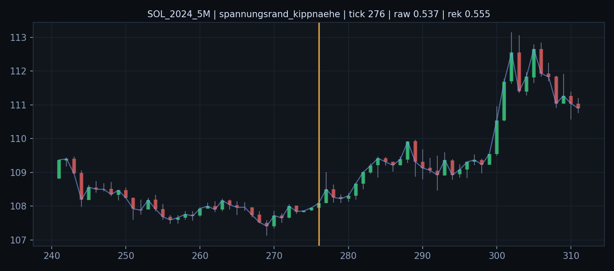

# Befund 1213 - Chartfenster der realen Hochlastrollen

## Grundfrage

Sind Hochlast-Offenheit und Hochlast-Randnaehe auch in der sichtbaren Weltform unterscheidbar?

Die Bilder zeigen passive Chartfenster um die staerksten Hochlast-Ereignisse. Die orange Linie markiert den Ereignis-Tick.

## offene_variante

- `PAXG_2024_5M` Tick `1871`: Rohfeld `0.4329`, Rekopplung `0.6314`, Strain `0.2246`

- `PAXG_2024_5M` Tick `1531`: Rohfeld `0.4307`, Rekopplung `0.6223`, Strain `0.2356`

- `PAXG_2024_5M` Tick `1568`: Rohfeld `0.4298`, Rekopplung `0.6570`, Strain `0.2277`

- `BTC_2024_5M` Tick `1682`: Rohfeld `0.4234`, Rekopplung `0.6122`, Strain `0.2487`

## spannungsrand_kippnaehe

- `SOL_2024_5M` Tick `1776`: Rohfeld `0.5535`, Rekopplung `0.5509`, Strain `0.3302`

- `BTC_2024_5M` Tick `1173`: Rohfeld `0.5372`, Rekopplung `0.5362`, Strain `0.3417`

- `BTC_2024_5M` Tick `1402`: Rohfeld `0.5371`, Rekopplung `0.5551`, Strain `0.3256`

- `SOL_2024_5M` Tick `276`: Rohfeld `0.5365`, Rekopplung `0.5555`, Strain `0.3251`

## Ableitung

Die Chartfenster sind keine Strategieauswertung. Sie dienen nur dazu, Feldrollen an sichtbare Weltform zurueckzubinden.

Wie es weitergeht: Die Bildfenster sollten gegen Sinneswerte gelesen werden: Offenheit als Uebergangsraum, Rand/Kipp als hohe Aufnahme plus schwache Rekopplung.
