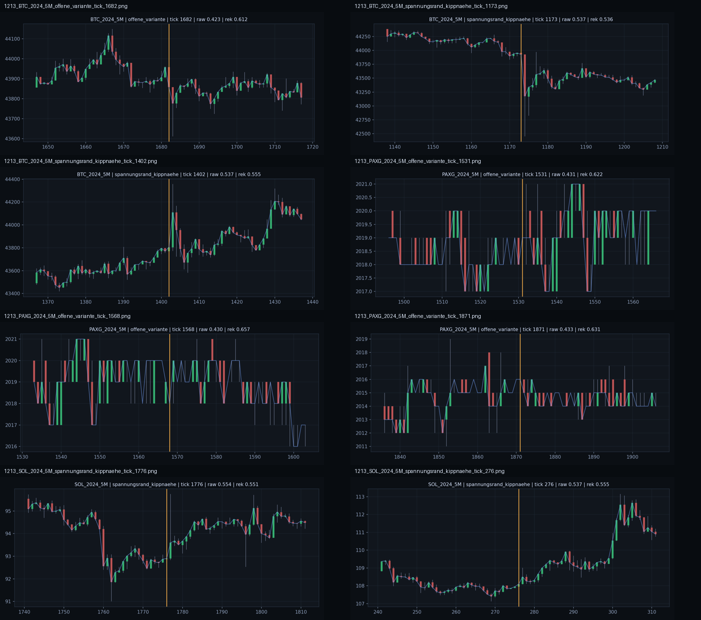

# Befund 1214 - Qualitative Lesung der Hochlast-Chartfenster

## Grundfrage

Sind `offene_variante` und `spannungsrand_kippnaehe` nur Zahlenrollen, oder zeigen sie sich auch als unterschiedliche Weltformen?

## Unterpruefung

Die in Befund 1213 erzeugten Chartfenster wurden gegen die Sinnes- und Feldwerte aus Befund 1212 gelesen.

Geplottete Beispiele:

- `offene_variante`: PAXG Tick `1531`, `1568`, `1871`; BTC Tick `1682`
- `spannungsrand_kippnaehe`: SOL Tick `276`, `1776`; BTC Tick `1173`, `1402`

Montage:



## Beobachtung: offene Variante

Die offenen Beispiele wirken nicht wie klarer Kollaps.

Typische Merkmale:

- kleinteilige Bewegung,
- seitliche oder wechselhafte Struktur,
- mehr Uebergangsraum als Bruch,
- Rekopplung bleibt hoeher als bei Rand/Kipp,
- Strain bleibt niedriger als bei Rand/Kipp.

PAXG zeigt dabei besonders deutlich eine Art flaches, rasterartiges Weltfenster. Die Bewegung ist aktiv genug, um Offenheit zu erzeugen, aber nicht stark genug, um das Feld in Randnaehe zu zwingen.

Lesart:

```text
Offene Variante = Weltform ist nicht tot,
aber auch nicht eindeutig zentriert.
Das Feld haelt Uebergang.
```

## Beobachtung: Spannungsrand / Kippnaehe

Die randnahen Beispiele liegen staerker an sichtbaren Impuls- oder Bruchstellen.

Typische Merkmale:

- hoehere Rohaufnahme,
- deutlich hoehere Lautheit,
- hoeherer Felddruck,
- schwaechere Rekopplung,
- hoeherer Strain,
- haeufiger abrupter Richtungsimpuls oder direkte Nachreaktion auf Bruch.

SOL Tick `1776` liegt nach einer groesseren Abwaertsbewegung mit anschliessender Gegenbewegung. BTC Tick `1173` liegt an einem scharfen Abwaertsimpuls. BTC Tick `1402` liegt an einem starken Aufwaertsimpuls mit anschliessender Reaktion.

Lesart:

```text
Rand/Kipp = Weltform wirkt nicht nur offen,
sondern drueckt das Feld an eine belastete Rekopplungsgrenze.
```

## Abgrenzung

Wichtig ist die Trennung:

```text
Offenheit ist kein Fehler.
Offenheit ist ein Uebergangszustand.

Rand/Kipp ist enger.
Rand/Kipp entsteht, wenn hohe Aufnahme,
Lautheit, Druck und schwachere Rekopplung zusammenfallen.
```

Damit wird die MCM-Rolle nicht nur numerisch, sondern auch weltbezogen lesbar.

## Schlussfolgerung

Die Chartfenster stuetzen die bisherige Achsenlesung:

```text
Sehen zeigt Formlage.
Hoeren bringt zeitliche Impulsnaehe.
Rezeptoren dosieren Aufnahme.
Das MCM-Feld bildet daraus Zentrum, Offenheit oder Randnaehe.
```

Der wichtigste Punkt:

```text
Reale Weltspannung fuehrt nicht direkt zu Rand/Kipp.
Sie erzeugt zuerst offenen Uebergangsraum.
Rand/Kipp entsteht erst bei belasteter Rekopplung.
```

## Wie es weitergeht

Als naechstes sollte geprueft werden, ob `offene_variante` zeitlich vor `spannungsrand_kippnaehe` liegt oder ob beide Rollen unabhaengige Feldantworten sind. Das waere der naechste Schritt von Einzelbildern zu Feldphasen.
