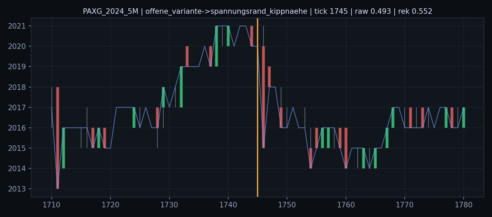
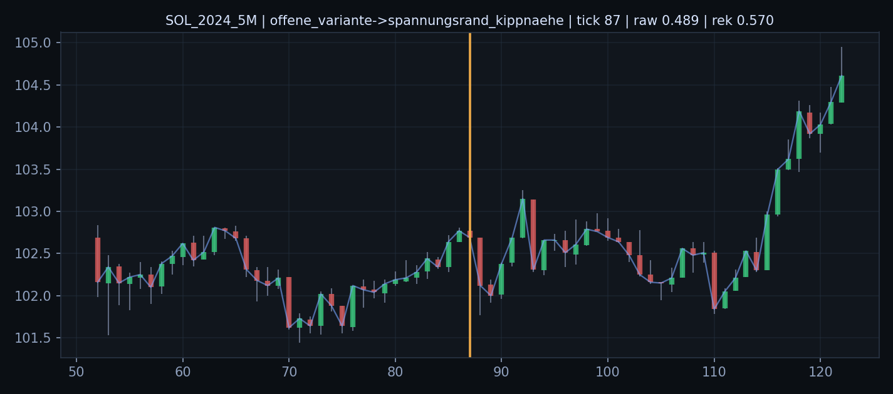
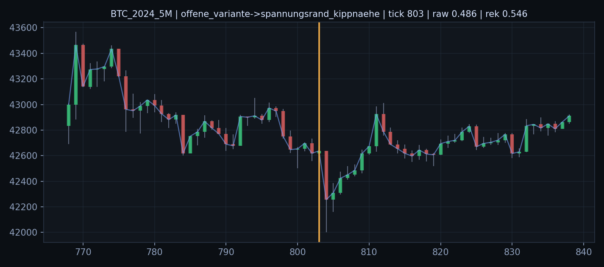
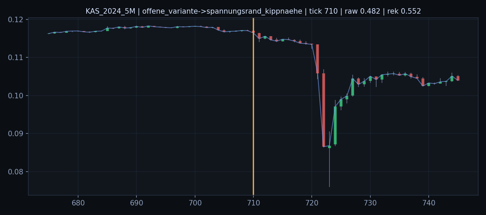
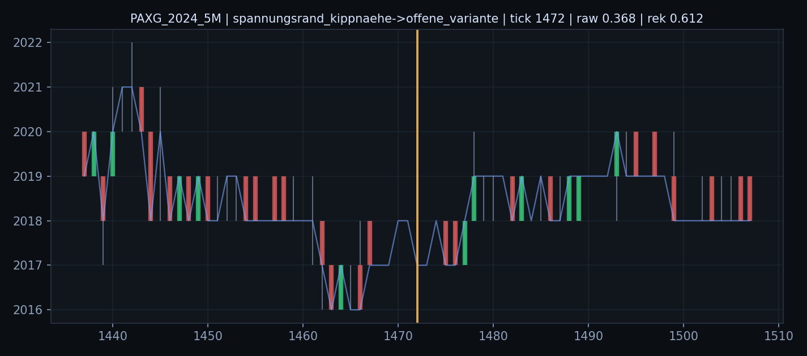
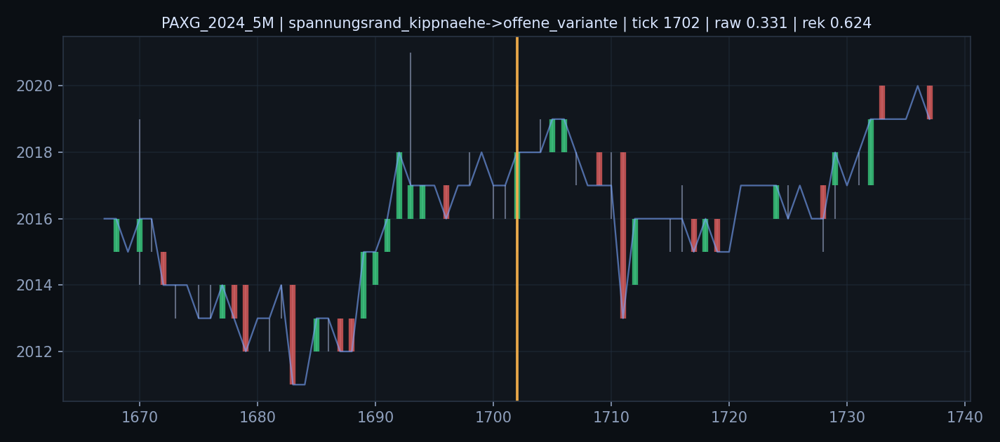
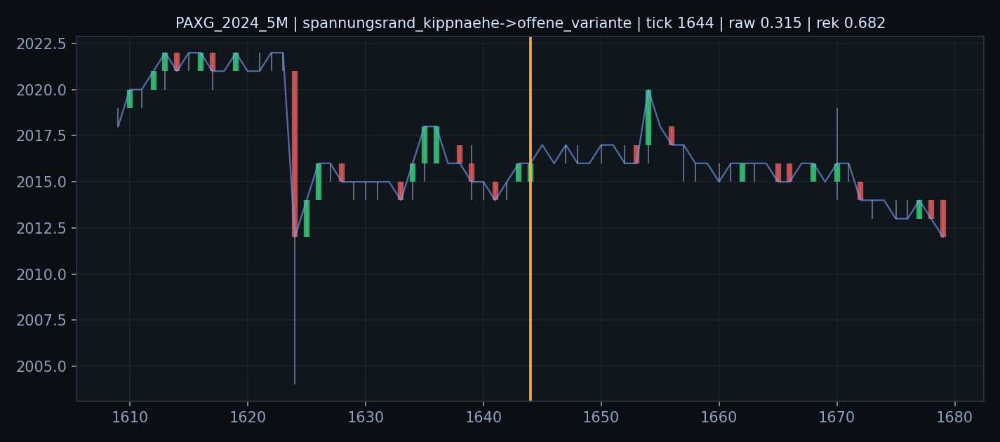
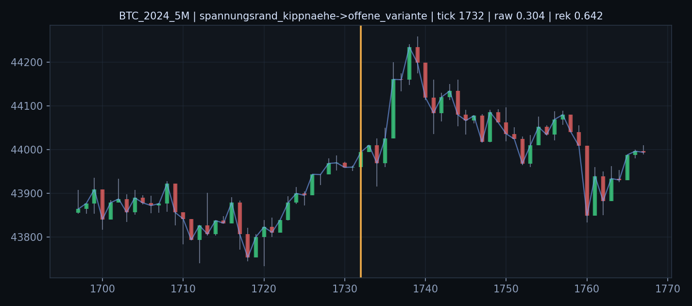

# Befund 1216 - Direkte Rollenuebergang-Chartfenster

## Grundfrage

Wie sehen die direkten Uebergaenge `Offen -> Rand` und `Rand -> Offen` in der Rohwelt aus?

Die orange Linie markiert den Starttick der neuen Rolle.

## offene_variante->spannungsrand_kippnaehe

- `PAXG_2024_5M` Tick `1745`: vorherige Dauer `2`, aktuelle Dauer `1`, Rohfeld `0.4932`, Rekopplung `0.5524`, Strain `0.3245`

- `SOL_2024_5M` Tick `87`: vorherige Dauer `3`, aktuelle Dauer `1`, Rohfeld `0.4893`, Rekopplung `0.5704`, Strain `0.2948`

- `BTC_2024_5M` Tick `803`: vorherige Dauer `1`, aktuelle Dauer `1`, Rohfeld `0.4858`, Rekopplung `0.5459`, Strain `0.3288`

- `KAS_2024_5M` Tick `710`: vorherige Dauer `1`, aktuelle Dauer `1`, Rohfeld `0.4820`, Rekopplung `0.5524`, Strain `0.3231`

## spannungsrand_kippnaehe->offene_variante

- `PAXG_2024_5M` Tick `1472`: vorherige Dauer `1`, aktuelle Dauer `1`, Rohfeld `0.3684`, Rekopplung `0.6115`, Strain `0.2394`

- `PAXG_2024_5M` Tick `1702`: vorherige Dauer `1`, aktuelle Dauer `1`, Rohfeld `0.3310`, Rekopplung `0.6238`, Strain `0.2237`

- `PAXG_2024_5M` Tick `1644`: vorherige Dauer `1`, aktuelle Dauer `1`, Rohfeld `0.3149`, Rekopplung `0.6822`, Strain `0.2079`

- `BTC_2024_5M` Tick `1732`: vorherige Dauer `1`, aktuelle Dauer `2`, Rohfeld `0.3041`, Rekopplung `0.6424`, Strain `0.2025`

## Ableitung

Diese Bilder dienen der passiven Feldphasen-Lesung. Sie pruefen, ob Offenheit eine Vorphase von Rand/Kipp ist oder ob Rand/Kipp als direkter Impulszustand erscheint.

Wie es weitergeht: Die Bilder sollten gegen die Segmentwerte gelesen werden. Danach kann die Feldphasen-Mechanik als Vorraum/Pendelbewegung dokumentiert werden.
