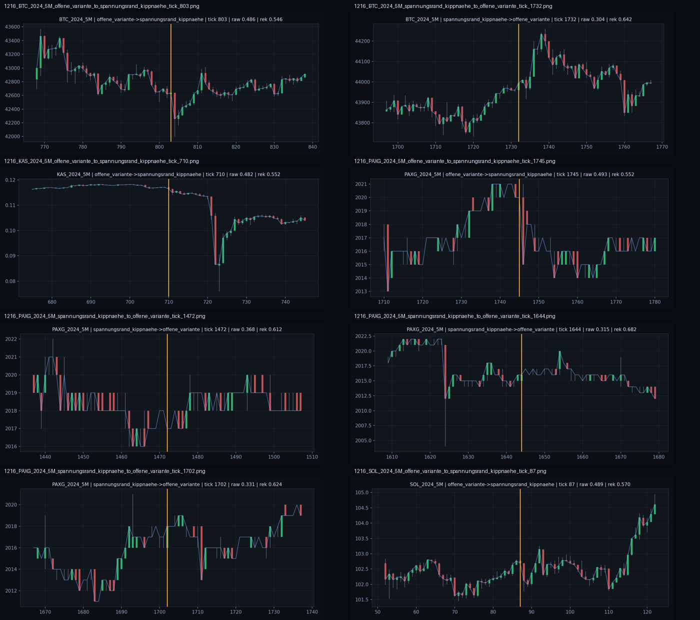

# Befund 1217 - Offenheit und Randnaehe als Feldphasen

## Grundfrage

Ist `offene_variante` eine Vorphase von `spannungsrand_kippnaehe`, oder sind beide Rollen unabhaengige Feldantworten?

## Unterpruefung

Befund 1215 zeigte:

| Welt | Randsegmente | Rand nach Offen | Quote |
|---|---:|---:|---:|
| `SOL_2024_5M` | `34` | `30` | `0.8824` |
| `BTC_2024_5M` | `34` | `31` | `0.9118` |
| `KAS_2024_5M` | `37` | `34` | `0.9189` |
| `PAXG_2024_5M` | `32` | `25` | `0.7812` |

Direkte Uebergaenge:

- `offene_variante -> spannungsrand_kippnaehe`: `67`
- `spannungsrand_kippnaehe -> offene_variante`: `120`

Befund 1216 plottete die staerksten direkten Uebergaenge:



## Befund

Die Daten sprechen nicht fuer eine einfache Einbahnstrasse.

Stattdessen zeigt sich eine Feldphasen-Logik:

```text
Offenheit ist haeufig ein Vorraum vor Rand/Kipp.
Rand/Kipp kippt aber noch haeufiger zurueck in Offenheit.
```

Das bedeutet:

```text
Offenheit = Feld haelt Uebergang.
Rand/Kipp = Feld wird an eine belastete Rekopplungsgrenze gedrueckt.
Zurueck nach Offenheit = Feld entlastet, aber bleibt noch nicht zwingend zentriert.
```

## Weltform-Lesung

### Offen -> Rand

Die `Offen -> Rand` Bilder liegen haeufig am Beginn oder in der Naehe eines deutlichen Impulses.

Typische Form:

- offene Vorphase,
- dann abrupter Richtungsimpuls oder Bruch,
- Rohaufnahme steigt,
- Rekopplung sinkt,
- Strain steigt.

Lesart:

```text
Der Uebergangsraum traegt nicht mehr genug.
Das Feld wird an den Rand gedrueckt.
```

### Rand -> Offen

Die `Rand -> Offen` Bilder wirken haeufig wie Nachpendeln oder Entlastung nach vorheriger Spannung.

Typische Form:

- vorheriger Impuls oder Bruch,
- anschliessende Beruhigung oder Gegenbewegung,
- Rekopplung verbessert sich relativ,
- das Feld bleibt aber noch offen statt sofort zentriert.

Lesart:

```text
Das Feld verlaesst Randnaehe,
aber es bleibt im Uebergangsraum.
```

## MCM-Schlussfolgerung

`offene_variante` ist kein schwacher Fehlerzustand. Sie ist eine tragende Zwischenphase.

Fachlich ergibt sich:

```text
Zentrum        = geordnete Rekopplung
Offenheit     = gehaltener Uebergangsraum
Rand/Kipp     = belastete Rekopplungsgrenze
Rueck-Offen   = Entlastung ohne vollstaendige Zentrierung
```

Damit wird das MCM-Feld zeitlich lesbarer:

```text
Feldrollen sind nicht nur Orte.
Sie sind Phasen einer Feldbewegung.
```

## Wie es weitergeht

Als naechstes sollte eine kleine Feldphasen-Matrix aufgebaut werden: `Zentrum`, `Offen`, `Rekopplungsnaehe`, `Rand/Kipp` als passive Bewegungsformen mit typischen Uebergaengen und Weltmerkmalen.
