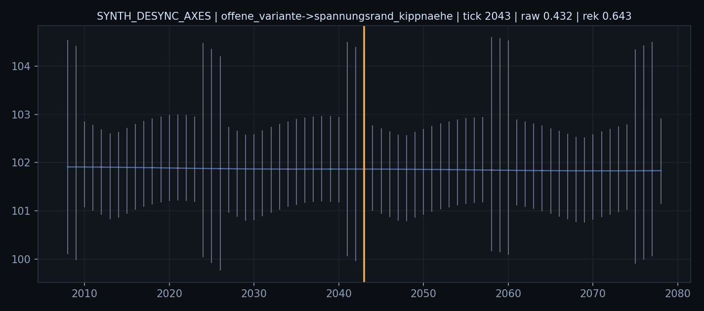
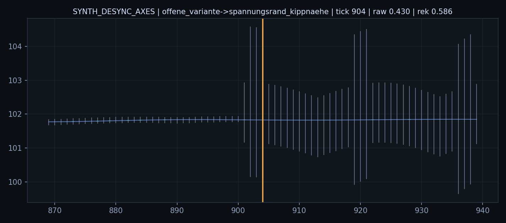
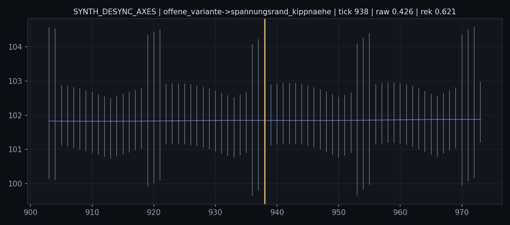
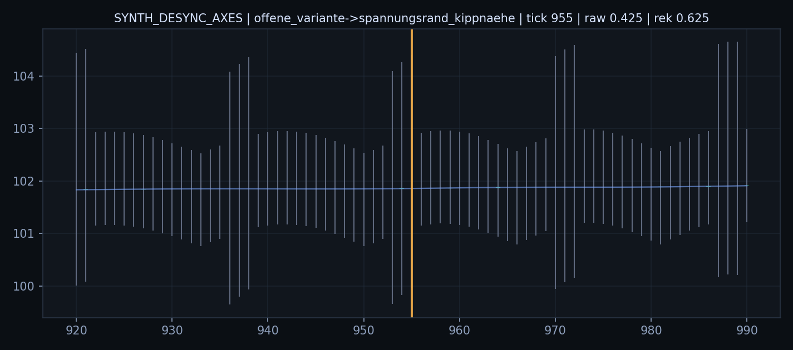
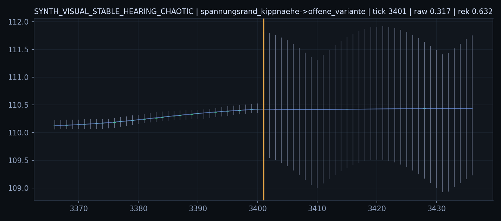
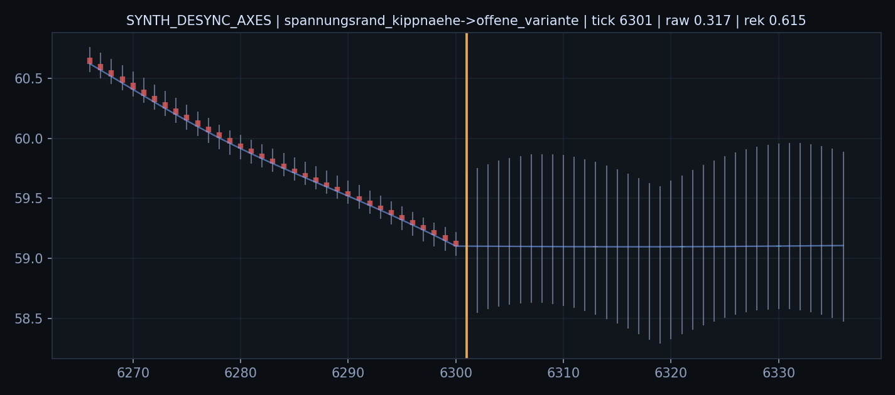
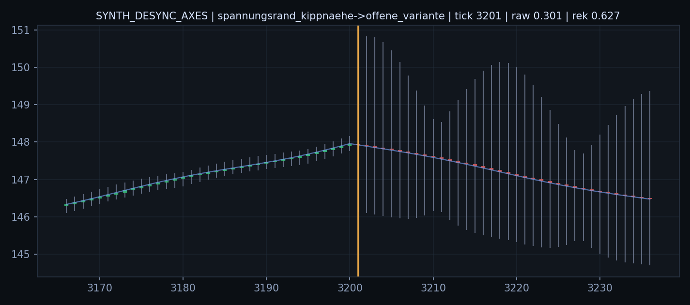
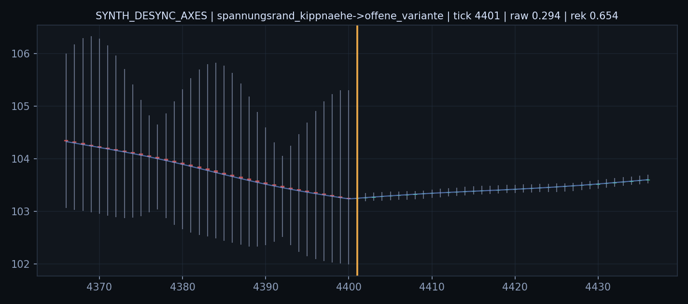

# Befund 1231 - Synthetische Sinnesachsen Offen/Rand Chartfenster

## Grundfrage

Wie sehen die direkten Uebergaenge `Offen -> Rand` und `Rand -> Offen` in der Rohwelt aus?

Die orange Linie markiert den Starttick der neuen Rolle.

## offene_variante->spannungsrand_kippnaehe

- `SYNTH_DESYNC_AXES` Tick `2043`: vorherige Dauer `1`, aktuelle Dauer `1`, Rohfeld `0.4320`, Rekopplung `0.6430`, Strain `0.2622`

- `SYNTH_DESYNC_AXES` Tick `904`: vorherige Dauer `2`, aktuelle Dauer `1`, Rohfeld `0.4298`, Rekopplung `0.5862`, Strain `0.2807`

- `SYNTH_DESYNC_AXES` Tick `938`: vorherige Dauer `2`, aktuelle Dauer `1`, Rohfeld `0.4257`, Rekopplung `0.6205`, Strain `0.2515`

- `SYNTH_DESYNC_AXES` Tick `955`: vorherige Dauer `2`, aktuelle Dauer `1`, Rohfeld `0.4253`, Rekopplung `0.6249`, Strain `0.2515`

## spannungsrand_kippnaehe->offene_variante

- `SYNTH_VISUAL_STABLE_HEARING_CHAOTIC` Tick `3401`: vorherige Dauer `1`, aktuelle Dauer `1`, Rohfeld `0.3168`, Rekopplung `0.6319`, Strain `0.2215`

- `SYNTH_DESYNC_AXES` Tick `6301`: vorherige Dauer `1`, aktuelle Dauer `1`, Rohfeld `0.3167`, Rekopplung `0.6150`, Strain `0.2451`

- `SYNTH_DESYNC_AXES` Tick `3201`: vorherige Dauer `1`, aktuelle Dauer `2`, Rohfeld `0.3011`, Rekopplung `0.6269`, Strain `0.2251`

- `SYNTH_DESYNC_AXES` Tick `4401`: vorherige Dauer `1`, aktuelle Dauer `3`, Rohfeld `0.2938`, Rekopplung `0.6537`, Strain `0.1975`

## Ableitung

Diese Bilder dienen der passiven Feldphasen-Lesung. Sie pruefen, ob Offenheit eine Vorphase von Rand/Kipp ist oder ob Rand/Kipp als direkter Impulszustand erscheint.

Wie es weitergeht: Die Bilder sollten gegen die Segmentwerte gelesen werden. Danach kann die Feldphasen-Mechanik als Vorraum/Pendelbewegung dokumentiert werden.
