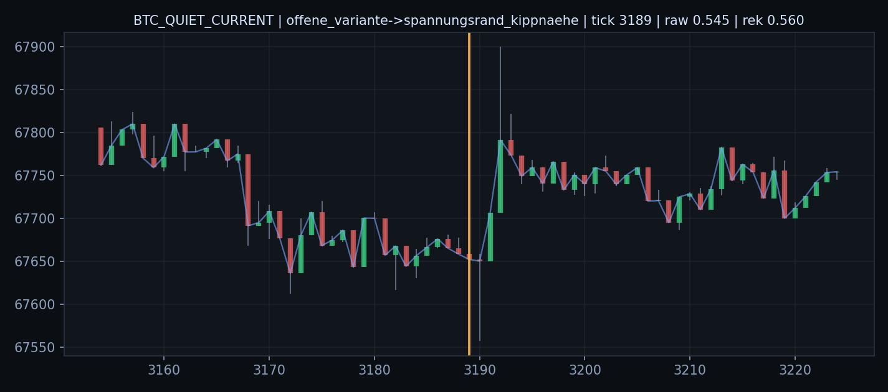
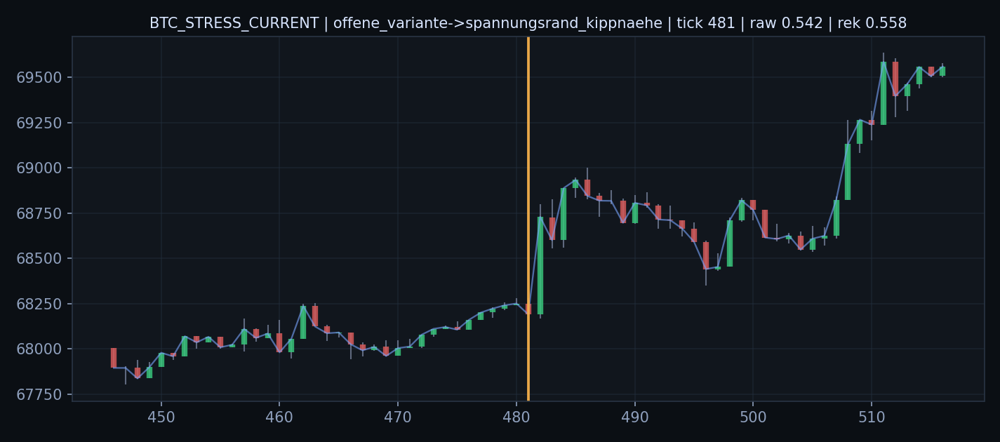
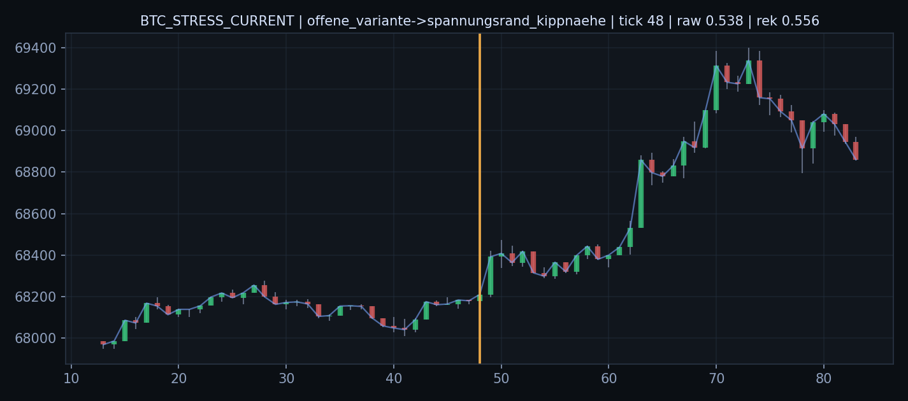
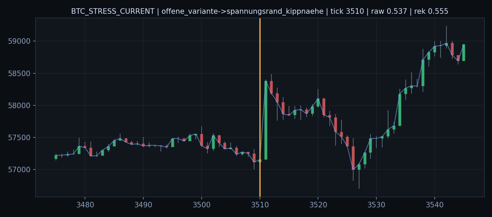
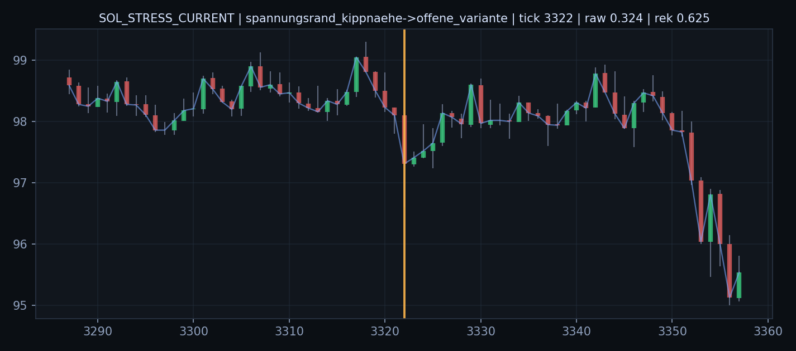
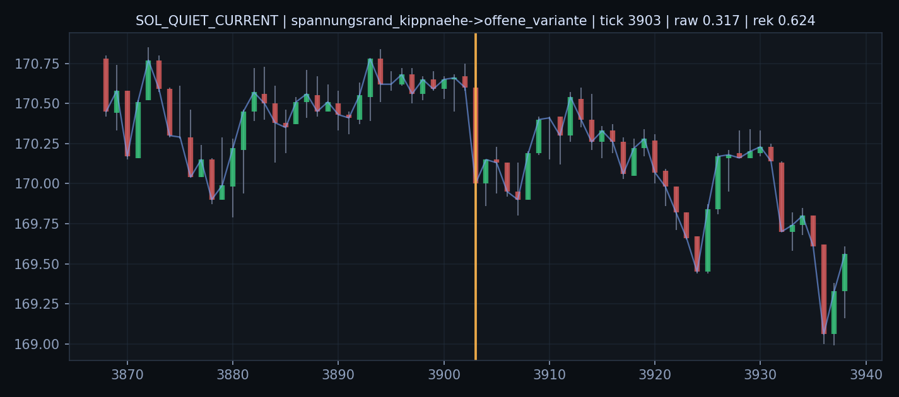
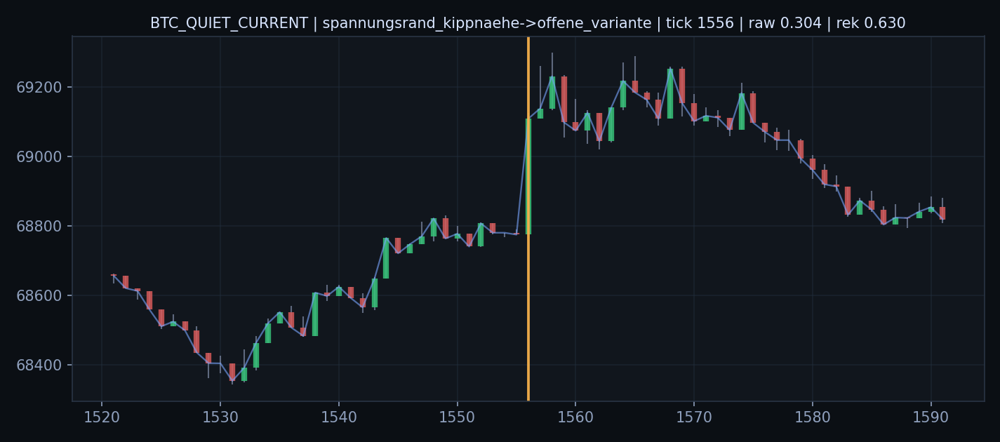
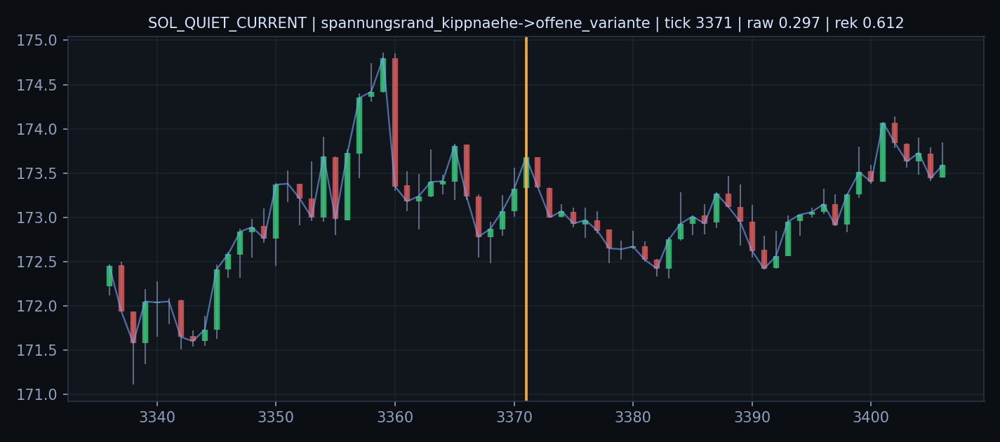

# Befund 1233 - Reale Stress/Quiet Offen/Rand Chartfenster 5m

## Grundfrage

Wie sehen die direkten Uebergaenge `Offen -> Rand` und `Rand -> Offen` in der Rohwelt aus?

Die orange Linie markiert den Starttick der neuen Rolle.

## offene_variante->spannungsrand_kippnaehe

- `BTC_QUIET_CURRENT` Tick `3189`: vorherige Dauer `1`, aktuelle Dauer `1`, Rohfeld `0.5446`, Rekopplung `0.5598`, Strain `0.3178`

- `BTC_STRESS_CURRENT` Tick `481`: vorherige Dauer `1`, aktuelle Dauer `1`, Rohfeld `0.5417`, Rekopplung `0.5578`, Strain `0.3187`

- `BTC_STRESS_CURRENT` Tick `48`: vorherige Dauer `2`, aktuelle Dauer `1`, Rohfeld `0.5377`, Rekopplung `0.5561`, Strain `0.3230`

- `BTC_STRESS_CURRENT` Tick `3510`: vorherige Dauer `2`, aktuelle Dauer `1`, Rohfeld `0.5370`, Rekopplung `0.5554`, Strain `0.3246`

## spannungsrand_kippnaehe->offene_variante

- `SOL_STRESS_CURRENT` Tick `3322`: vorherige Dauer `1`, aktuelle Dauer `1`, Rohfeld `0.3244`, Rekopplung `0.6255`, Strain `0.2272`

- `SOL_QUIET_CURRENT` Tick `3903`: vorherige Dauer `1`, aktuelle Dauer `1`, Rohfeld `0.3168`, Rekopplung `0.6238`, Strain `0.2257`

- `BTC_QUIET_CURRENT` Tick `1556`: vorherige Dauer `1`, aktuelle Dauer `1`, Rohfeld `0.3039`, Rekopplung `0.6299`, Strain `0.2271`

- `SOL_QUIET_CURRENT` Tick `3371`: vorherige Dauer `1`, aktuelle Dauer `1`, Rohfeld `0.2972`, Rekopplung `0.6119`, Strain `0.2376`

## Ableitung

Diese Bilder dienen der passiven Feldphasen-Lesung. Sie pruefen, ob Offenheit eine Vorphase von Rand/Kipp ist oder ob Rand/Kipp als direkter Impulszustand erscheint.

Wie es weitergeht: Die Bilder sollten gegen die Segmentwerte gelesen werden. Danach kann die Feldphasen-Mechanik als Vorraum/Pendelbewegung dokumentiert werden.
