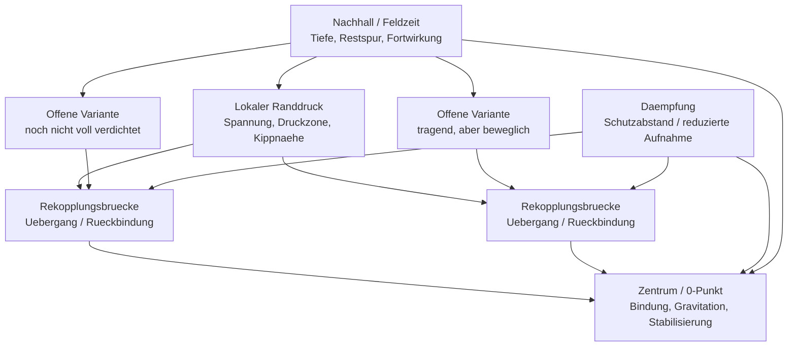

# 1725 - Aktuelle MCM-Topologie-Skizze

## Zweck

Diese Datei fasst die aktuelle Topologie-Lesung aus den letzten
Randdruck-, Asset- und Feldzeitpruefungen als kompakte Forschungsskizze
zusammen.

Wichtig:

```text
Die Skizze ist keine Runtime-Regel.
Sie ist kein Zielbild, nach dem MINI_DIO gebaut wurde.
Sie ist eine nachgelagerte Lesart der bisherigen Befunde.
```

## Ausgangsbefund

Die letzten Pruefungen zeigen keine einfache starre Topologieklasse.
Stattdessen entsteht eine geschichtete Rollenordnung:

```text
globale Feldrolle
lokaler Druck
Rekopplungsqualitaet
Daempfung / Schutzabstand
offene Varianten
Nachhall und Feldzeit
```

Besonders wichtig:

```text
lokaler Randdruck != globale Randrolle
Daempfung != Kontaktverlust
Rekopplung != nur Zentrum
```

## Kompakte Rollenform



## Lesart der Form

### Zentrum / 0-Punkt

Das Zentrum ist nicht nur ein Punkt. Es wirkt in der aktuellen Lesung wie eine
Bindungs- oder Gravitationsfunktion des Feldes.

```text
Zentrum = Bindung / Stabilisierung / Rueckfuehrung
```

### Randdruck

Randdruck erscheint nicht zwingend als globale Randrolle. Er tritt lokal auf
und kann vom Feld rekoppelt werden.

```text
Rand = lokaler Druckraum
```

### Rekopplung

Rekopplung wirkt als Uebergangsfunktion. Sie kann Randdruck wieder in eine
tragende Feldnaehe bringen.

```text
Rekopplung = Bruecke / Korridor / Rueckbindung
```

### Daempfung

Daempfung ist nicht automatisch schlecht. Die PAXG-1h-Ruecklesung zeigt
gedaempfte Rekopplung: Abstand bleibt vorhanden, aber Kontakt reisst nicht ab.

```text
Daempfung = Schutzabstand / regulierter Kontakt
```

### Offene Varianten

Offene Varianten sind nicht voll verdichtet. Sie koennen tragend sein, aber
bleiben beweglich.

```text
Offenheit = Bedeutungsraum vor voller Verdichtung
```

### Nachhall / Feldzeit

Nachhall gibt der Topologie zeitliche Tiefe. Eine Lage verschwindet nicht
sofort, sondern wirkt als Restspur weiter.

```text
Feldzeit = gewirkte Energie im Feld
```

## Aktuelle Skizze als Textform

```text
                lokaler Randdruck
             /          |          \
      offene Variante   |   offene Variante
             \          |          /
          Rekopplungsbruecken / Uebergang
                    \     /
                     \   /
                 Zentrum / 0-Punkt
                     ^
                     |
              Daempfung / Schutzabstand

Nachhall und Feldzeit liegen nicht daneben,
sondern geben der ganzen Form Tiefe.
```

## Was daran stabil wirkt

Aus den bisherigen Befunden wirkt stabil:

- Randdruck ist lokal lesbar.
- Rekopplung erscheint wiederholt als dominante globale Naehe.
- Daempfung kann Kontakt erhalten statt Kontakt zu verlieren.
- Weltzeit veraendert Feldqualitaet.
- Die Topologie ist eher Netzwerk/Rollenraum als starre Symboltabelle.

## Was noch offen ist

Noch nicht stabil genug geklaert:

- ob dieselbe Rollenform in noch mehr Assets gleich tief erscheint,
- ob Randdruck-Spitzen an Weltstellen reproduzierbar bleiben,
- ob offene Varianten ueber laengere Weltfolgen zu eigenen Bedeutungsinseln reifen,
- ob gedaempfte Rekopplung assettypisch oder abschnittstypisch ist.

## Bedeutung fuer MINI_DIO

Die aktuelle Topologie spricht dafuer, MINI_DIO nicht als festes
Klassifikationssystem zu lesen.

Treffender ist:

```text
MINI_DIO bildet ein passives MCM-Feld,
in dem Weltkontakt zu lokalen Druckraeumen,
Rekopplungsbruecken,
Daempfung,
Nachhall
und Bedeutungsnaehe fuehrt.
```

## Wie es weitergeht

Als naechstes sollte diese Skizze gegen neue Laeufe gehalten werden.
Entscheidend ist, ob neue Welten dieselbe Rollenform benutzen, neue
Bruecken bilden oder offene Varianten zu eigenen Inseln verdichten.
